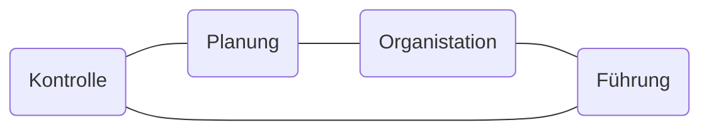

Die Aufgabe der Unternehmensführung is t  die Steuerung des Unternehmens, damit die gesetzten Unternehmensziele erreicht werden.
Vorgesetzte haben im Rahmen der Führung u.a. die Aufgabe, die Mitarbeiterinnen und Mitarbeiter im Sinne der Unterhnehmesnziele zu beeinflussen...
Sofern einer Stelle im Unternehmen Mitarbeiter unterstellt sind (Instanz = Stelle mit Führungsverantwortung), sind diese Führungsaufgaben auch wahrzunehmen

## Taylorismus
Vorarbeiter der Anweisungen erteilt, Mitarbeiter müssen Arbeitspensum erfüllen -> Entlohnung

## Human Relations

## Humanisierung des Arbeitsplatzes
Betriebliche Sozial

## Motivationstheorien

## Ziel der Führung
Das Ziel der Führung von Mitarbeiterinnen besteht primär darin, das Verhalten von Mitarbeirtern so zu beeinflussen, dass gemeinsame Ziele erreicht werden.

## Motivation
### Intrinsische und Extrinsische Motivation
> Intrinsisch-durch die Tätigkeit selbst
Extrinsisch-durch die Folgen der Tätigkeit

#### Intrinsisch :
Die Ausführung der Handlung ist aus sich heraus Belohnung genug
z.B. Neugier, Spaß, Interesse, gutes Gewissen
##### Bsp :
Besuch eines Italienischkurses nur zur privaten Weiterbildung
Lösung von schwierigen Sudokus als geistige Herausforderung
exakte Mülltrennung aus Umweltschutzgründen

#### Extrinsisch:
Die Ausführung der Handlung ist nur durch äußere Belohnung genug.
### Zwei Faktoren-Theorie von Herzberg
### Motivatoren
- Leistungserfolg
- Anerkennung
- Arbeitsinhalt
- Verantwortung
- Entfaltungsmöglichkeiten
### Hygienefaktoren
- Bezahlung
- Arbeitsplatzbedingungen
- Arbeitsplatzsicherheit
- Status und ansehen
- Führungsstil der Vorgesetzten
- Unternehmenspolitik

>  Zufriedenheit ist nicht gleich nicht unzufrieden

## Theorie  x und y

### x
- Abscheu
- Muss kontrolliert werden
- Strafandrohung
- wird gerne geführt
- meidet verantwortung

### Autoritärer Führungsstil
## Laissez-faire Führungsstil

## Weitere Führungsstile
- Demokratischer Führungsstil
- 