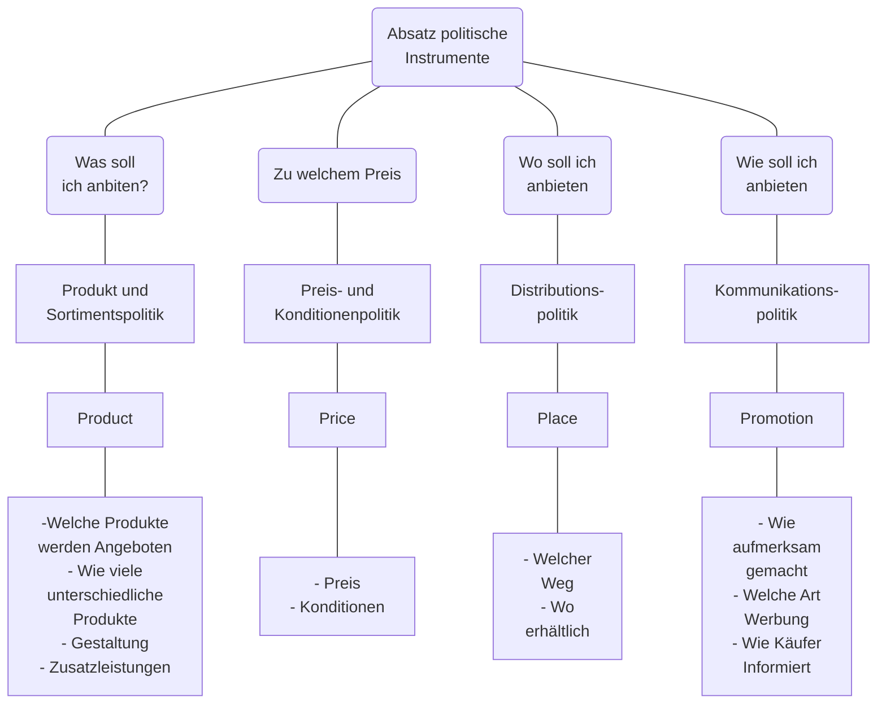
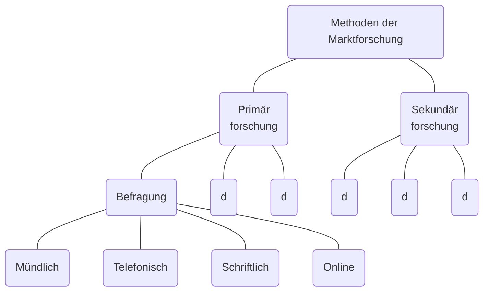
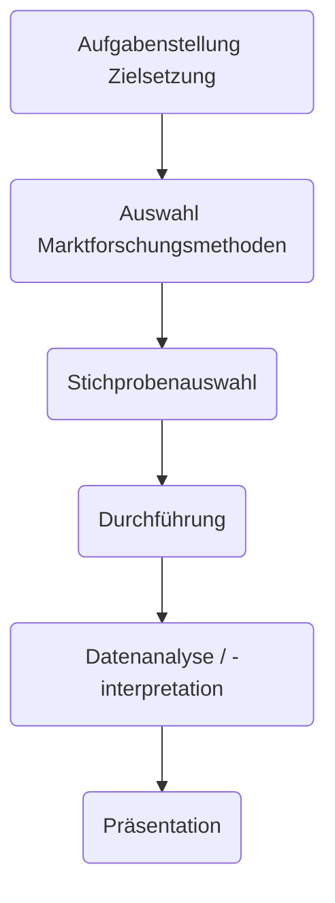

## Die 4 Ps des Marketings
1. **Product**
	Produkt und Sortimentspolitik
2. **Place**
	Preis und Konditionenpolitik
3. **Price**
	Absatzorganisation
4. **Promotion**
	Werbung & Verkaufsförderung

## Marktforschung

### Marktdiagnose
Erfassung der gegenwärtigen Marktsituation
#### Marktanalyse
Analyse des Marktes zu einem bestimmten Zeitpunkt
#### Marktbeobachtung
Beobachtung des Marktes im Zeitablauf

### Marktprognose
Abschätzung der zukünftigen Marktentwicklung

### Marktorientierte Fragen


### Methoden der Marktforschung

#### Befragung
Umfrage unter Käufern am:
- Testmarkt
- Experteninterviews
**Messziele**:
- Motive
- Einstellungen
- Image
#### Beobachtung
Registrierung von Verhaltensweisen
**Messziel**:
- Kundenverhalten
- Umsatzzeitpunkt
- Reaktion bei Veränderungen
#### Labortest
Verhaltensreaktionen mit Versuchspersonen unter Labor Bedingungen
**Messziel**:
- Verpackung
- Werbemittelwirkung
#### Markttest
Kaufverhalten im Testmarkt
**Messziel**:
- Wirkung aller Marketingmaßnahmen in Echt


### Praktische Marktforschung am Beispiel JYSK
#### Distributionspolitik

##### Auf welchem weg sollen die Produkte den Kunden erreichen?

 ##### Wo erhältlich?
 


### Primärforschung
_Feldforschung_
#### Befragungen
##### Mündliche Befragung
| Vorteile                                                   | Nachteile                        |
| ---------------------------------------------------------- | -------------------------------- |
| Auch für schwierige Themen                                 | Zeitaufwendig                    |
| Umfangreiche Befragungen möglich                           | Relativ hohe Kosten je Befragung |
| Geringe Verweigerungsrate im Vergleich zu anderen Methoden | Interviewereinfluss              |
| Interviewer kann flexibel reagieren                        |                                  |
##### Telefonische Befragung
| Vorteile                 | Nachteile                                        |
| ------------------------ | ------------------------------------------------ |
| Relativ rasch und billig | Verhältnismäßig einfache Fragestellungen stellen |
|                          | Nur für Personen die ein Telefon besitzen        |
##### Schriftliche Befragung
| Vorteile                         | Nachteil                           |
| -------------------------------- | ---------------------------------- |
| Räumlich weit entfernte Personen | Niedrige Rücklaufquote             |
| Große Anzahl                     | Umfang der Befragung begrenzt      |
| niedrige Kosten                  | Beeinflussung durch Dritte möglich |
##### Online Befragung
| Vorteile                                             | Nachteile                         |
| ---------------------------------------------------- | --------------------------------- |
| Keine Portokosten                                    | Nicht alle verwenden das Internet |
| Elektronische Antworten direkt ins Statistikprogramm |                                   |

### Sekundärforschung
_Schreibtischforschung_

Informationen aus...
- Umsatzstatistiken
- Erfahrung und Wissen der Mitarbeiter\*Innen
- Umfeld des Betriebes wie Kunden und Konkurrenzunternehmen
- aus den Medien
- aus dem Internet
- aus Beobachtung
- Branchenverzeichnisse
- Firmenveröffentlichungen
- Statistische Ämter

### Schritte eines Marktforschungsprojekts

#### Datenquellen

##### Allgemein
- Wirtschaftskammer Österreich
	- www.wko.at
- Statistik Austria
	- www.statistik.at
- Österreichisches Staatsarchiv
	- www.oesta.gv.at
- Österreichische Nationalbibliothek
	- www.onbc.ac.at
- Schulbibliothek
	- [10.0.0.120]()
- …

##### Getränkemarkt
- Getränkeverband Österreichs
- Getränkegroßhändler
- Professionelle Unternehmensberater

#### Marktvolumen und Marktpotential
Marktvolumen Cola Getränke - Marktpotential Cola-Getränke

```functionplot
---
title: 
xLabel: Jahre (1 = 2017, 3, 2020)
yLabel: Liter in Mio
bounds: [1,4,240,310]
disableZoom: false
grid: true
---
f(x)=243 + (x-1)19
```
Absatz von Coca Cola

**Absoluter Marktanteil**: Marktanteil im Vergleich zum Marktvolumen
**Relativer Marktvolumen**: Marktanteil im Vergleich zum Marktführer

#### Marktpotential und Marktanteil
![[Drawing 2024-11-21 13.12.16.excalidraw]]

## Preispolitik (Product)
to be continued...