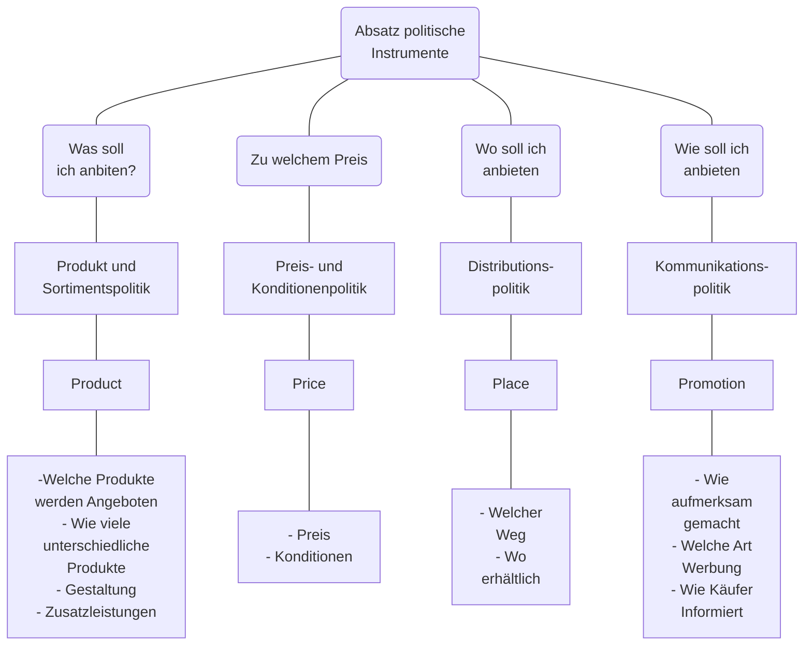
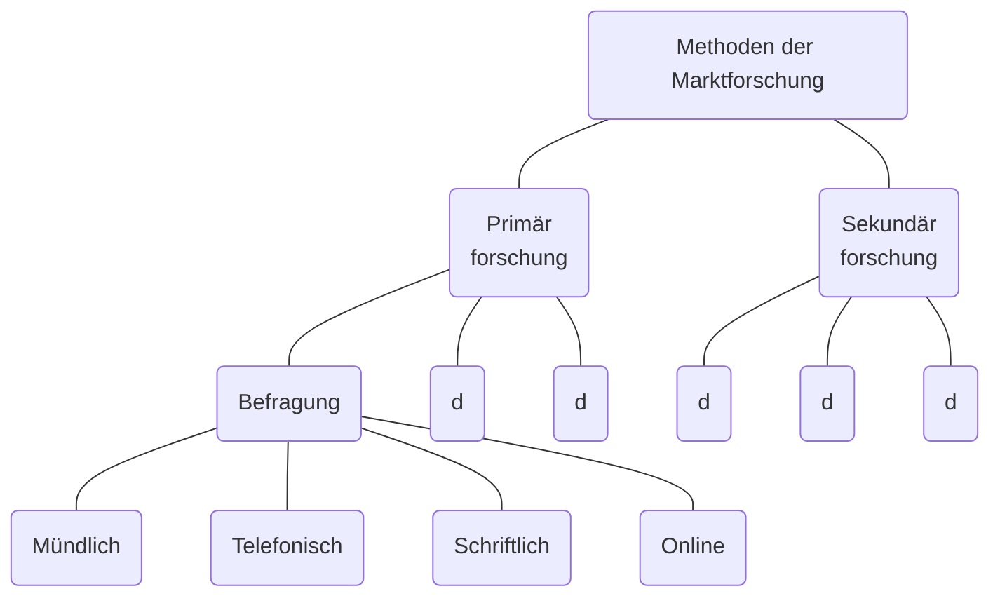
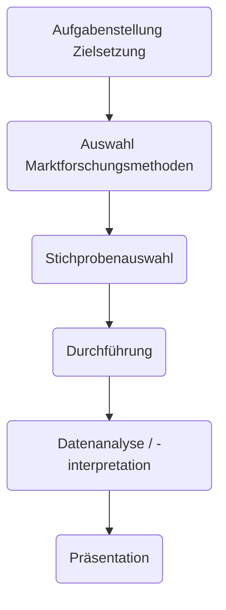
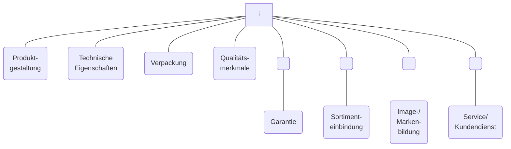
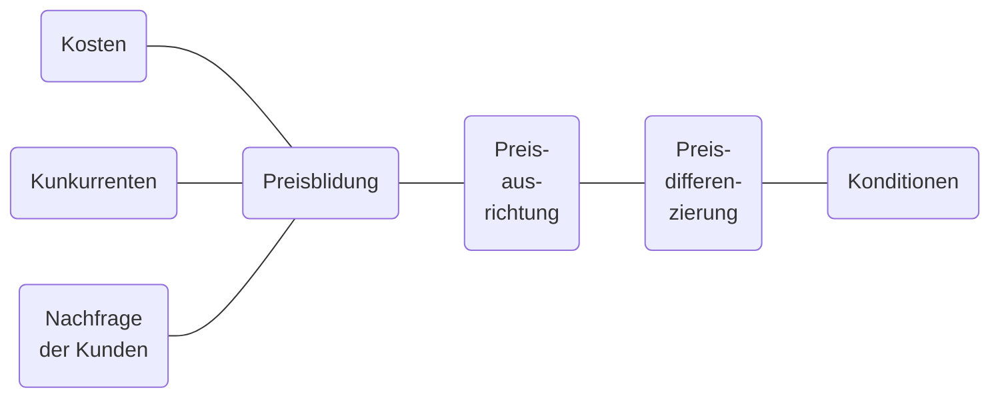
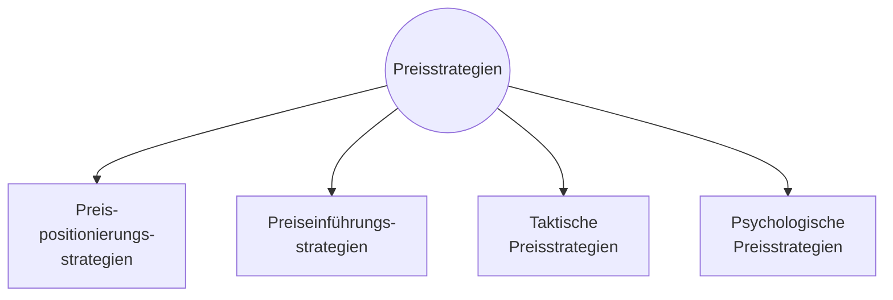
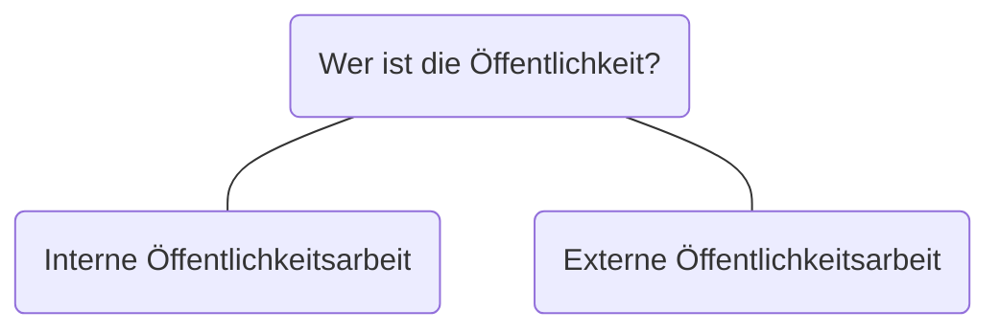

## Die 4 Ps des Marketings
1. **Product**
	Produkt und Sortimentspolitik
2. **Place**
	Preis und Konditionenpolitik
3. **Price**
	Absatzorganisation
4. **Promotion**
	Werbung & Verkaufsförderung

## Marktforschung

### Marktdiagnose
Erfassung der gegenwärtigen Marktsituation
#### Marktanalyse
Analyse des Marktes zu einem bestimmten Zeitpunkt
#### Marktbeobachtung
Beobachtung des Marktes im Zeitablauf

### Marktprognose
Abschätzung der zukünftigen Marktentwicklung

### Marktorientierte Fragen


### Methoden der Marktforschung

#### Befragung
Umfrage unter Käufern am:
- Testmarkt
- Experteninterviews
**Messziele**:
- Motive
- Einstellungen
- Image
#### Beobachtung
Registrierung von Verhaltensweisen
**Messziel**:
- Kundenverhalten
- Umsatzzeitpunkt
- Reaktion bei Veränderungen
#### Labortest
Verhaltensreaktionen mit Versuchspersonen unter Labor Bedingungen
**Messziel**:
- Verpackung
- Werbemittelwirkung
#### Markttest
Kaufverhalten im Testmarkt
**Messziel**:
- Wirkung aller Marketingmaßnahmen in Echt


### Praktische Marktforschung am Beispiel JYSK
#### Distributionspolitik

##### Auf welchem weg sollen die Produkte den Kunden erreichen?

 ##### Wo erhältlich?
 


### Primärforschung
_Feldforschung_
#### Befragungen
##### Mündliche Befragung
| Vorteile                                                   | Nachteile                        |
| ---------------------------------------------------------- | -------------------------------- |
| Auch für schwierige Themen                                 | Zeitaufwendig                    |
| Umfangreiche Befragungen möglich                           | Relativ hohe Kosten je Befragung |
| Geringe Verweigerungsrate im Vergleich zu anderen Methoden | Interviewereinfluss              |
| Interviewer kann flexibel reagieren                        |                                  |
##### Telefonische Befragung
| Vorteile                 | Nachteile                                        |
| ------------------------ | ------------------------------------------------ |
| Relativ rasch und billig | Verhältnismäßig einfache Fragestellungen stellen |
|                          | Nur für Personen die ein Telefon besitzen        |
##### Schriftliche Befragung
| Vorteile                         | Nachteil                           |
| -------------------------------- | ---------------------------------- |
| Räumlich weit entfernte Personen | Niedrige Rücklaufquote             |
| Große Anzahl                     | Umfang der Befragung begrenzt      |
| niedrige Kosten                  | Beeinflussung durch Dritte möglich |
##### Online Befragung
| Vorteile                                             | Nachteile                         |
| ---------------------------------------------------- | --------------------------------- |
| Keine Portokosten                                    | Nicht alle verwenden das Internet |
| Elektronische Antworten direkt ins Statistikprogramm |                                   |

### Sekundärforschung
_Schreibtischforschung_

Informationen aus...
- Umsatzstatistiken
- Erfahrung und Wissen der Mitarbeiter\*Innen
- Umfeld des Betriebes wie Kunden und Konkurrenzunternehmen
- aus den Medien
- aus dem Internet
- aus Beobachtung
- Branchenverzeichnisse
- Firmenveröffentlichungen
- Statistische Ämter

### Schritte eines Marktforschungsprojekts

#### Datenquellen

##### Allgemein
- Wirtschaftskammer Österreich
	- www.wko.at
- Statistik Austria
	- www.statistik.at
- Österreichisches Staatsarchiv
	- www.oesta.gv.at
- Österreichische Nationalbibliothek
	- www.onbc.ac.at
- Schulbibliothek
	- [10.0.0.120]()
- …

##### Getränkemarkt
- Getränkeverband Österreichs
- Getränkegroßhändler
- Professionelle Unternehmensberater

#### Marktvolumen und Marktpotential
Marktvolumen Cola Getränke - Marktpotential Cola-Getränke

```functionplot
---
title: 
xLabel: Jahre (1 = 2017, 3, 2020)
yLabel: Liter in Mio
bounds: [1,4,240,310]
disableZoom: false
grid: true
---
f(x)=243 + (x-1)19
```
Absatz von Coca Cola

**Absoluter Marktanteil**: Marktanteil im Vergleich zum Marktvolumen
**Relativer Marktvolumen**: Marktanteil im Vergleich zum Marktführer

#### Marktpotential und Marktanteil
![[Drawing 2024-11-21 13.12.16.excalidraw | 1000]]

## Produkt- und Sortimentspolitik (Product)

> Ein Produkt ist jedes Objekt, das auf einem Markt angeboten wird und geeignet ist, Wünsche und Bedürfnisse zu befriedigen

>Die Gesamtheit aller Produkte eines Unternehmens wird als Produktprogramm bezeichnet.
### Arten
- Sachgüter
- Dienstleistugnen
- Personen
- Orte
- Organisation

### Produktausprägung
| Produktausprägung  |                               |                |
| ------------------ | ----------------------------- | -------------- |
| Reine Sachleistung | Sachleistung + Dienstleistung | Dienstleistung |
|                    |                               |                |
|                    |                               |                |
Der Begriff **Extra Value Proposition** bezeichnet den Trend, zum Produkt zunehmend zusätliche Dienstleistungen anzubieten

### Besonderheiten von Dienstleistungen

Der Kunde bringt sich selbst in die Leistung ein (Restaurantbesuch)

Produktion und Konsumation erfolgt oft zeitgleich (Massage)

Die Kunden können das Ergebnis beeinflussen (Reisegruppe)

Bei Dienstleistungen besteht Kaufunsicherheit: Der Kunde kann oft im vorhinein nicht etwa Farbe, Design, etc. beurteilen wie bei einem Produkt.

Dienstleistungen sind nicht lagerfähig. Vorteil ist, dass keine entsprechenden Lagerräume geschaffen werden müssen, Nachteil ist jedoch, dass alle Ressourcen immer zur richtigen Zeit am richtigen Ort verfügbar sein müssen.

### Gestaltungselemente eines Produkts
Alle Gestaltungselemente eines Produkts müssen den Befüfnissen 


### Kundennutzen
Manche Unternehmen sind in Schwierigkeiten gekommen, da sie bei der Perfektionierung ihrer Produkte die Kunden aus dem Blick verloren haben

Die Kunden interessiert primär der persönliche Nutzen, den das Produkt liefern soll. Entsprechend müssen produktpolitische Entscheidungen am Kundennutzen ausgerichtet werden. Dabei unterscheidet man den objektiv messbaren Grundnutzen vom subjektiv empfunden Zusatznutzen und den psychologischen Nutzen

Der Nutzen ist wichtig für die Preisgestaltung und den Markterfolg eines Produkts bzw. einer Dienstleistung.

Der Nutzen ist nicht unbedingt stabil, d.h. durch Angebote von Mitbewerbern, technologische und gesellschaftliche Entwicklung kann er sich verändern (z.B. der Nutzen von MP3-Playern ist massiv durch die Verbreitung von Streaming-Diensten gesunken)

Der Nutzen eines Produkts bzw. eine Dienstleistung ist wichtig bei der Entwicklung von neuen Produkten und bei der Erstellung von Wachstumsprognosen.

### Arten der Produktpolitik
#### Produktvariation
ein bestehendes Produkt wird leicht verändert (verbesserter Geschmack, neue praktische Verpackung etc.)
#### Produktdifferenzierung
zu einem bereits auf dem Markt vorhandenen Produkt werden zusätzliche Produktvariationen entwickelt und vermarktet (z.B. weitere Geschmackssorten). 
Dadurch können neue Zielgruppen erreicht werden, ohne bisherige Kunden aufzugeben.
Ziel ist die Markterweiterung, Sortiment wird tiefer

#### Produktdiversifikation
ein neues Produkt oder Produktgruppe kommt zu einer bestehenden Produktgruppe hinzu. Eine Molkerei bietet neben herkömmlichen Milchprodukten nun auch proteinreiche Joghurts an.
Ziel ist die Eroberung neuer Märkte, Sortiment wird breiter

#### Produktinnovation
ein neues Produkt wird entwickelt und auf den Markt gebracht. Neben echten Innovationen zählen hierzu auch Produkte, die in vergleichbar auf dem Markt vorhanden sind und in das Leistungsangebot eines Unternehmens aufgenommen werden (Me-too-Innovation) 

schlechtes Image
neue gesetzliche Vorschriften
Änderung der Kundenbedürfnisse
Veralterung der Technik
neue, stärkere Konkurrenzprodukte

#### Preisgestaltung

Kosten/Konkurrenten/Nachfrage: **Orientierungsgrößen**
Preisbildung/Preisausrichtung/Preisdifferenzierung: **Preispolitik**
Konditionen: **Konditionenpolitik**
##### Preisausrichtung
- Hochpreis- versus Niedrigpreisstrategie
- Marktdurchdringungs- versus Abschaffungsstrategie


###### Preispositionierungsstrategien
- Hochpreisstrategie
- Marktpreisstrategie
- Niedrigpreisstrategie
###### Preiseinführungsstrategien
- Abschöpfungspreisstrategie
	- Hoher Preis solange keine Konkurrenz
- Marktdurchdringungsstrategie
	- Niedrige Preis führt zu gewinn von Marktanteile
###### Taktische Preisstrategien
- 
###### Psychologische Preisstrategien
##### Preisdifferenzierung
- zeitlich
- räumlich
- nach Käufern
- nach Abnahmemenge
- nach Vertriebsart
##### Konditionen
- Zahlungsbedingungen
- Rabatte
- Teilzahlung
- sonstige Kaufanreize
- Finanzierungsangebote

##### Preiselastizität
Wenn sich der Preis ändert ändert sich auch die Nachfrage.
###### Preisunelastisch
Wenn sich der Preis erhöht und die Nachfrage aber gleichbleibt (lebensnotwendige Produkte)

#### Distributionspolitik
- ökonomisch orientierte Ziele
	- Erhöhung von Absatzmenge, Umsatz, Marktanteil
	- Verbesserung der Deckungsbeiträge
	- Sicherstellung der Preisniveaus
	- Senkung der Distributionskosten
	- 
- versorgungsorientierte Ziele Distributionsgrad
	- Vermeidung von Distributionslücken
	- Verkürzung von Lieferzeiten
	- Lieferbereitschaft und -zuverlässigkeit
- psychologische orientierte Ziele
	- hohe Handelszufriedenheit
	- Verbesserung des Images eines Verkaufsweges
	- Erhöhung der Kooperationsbereitschaft des Handels 
	- Verbesserung der Qualifikation des Verkaufspersonals

##### Direktvertrieb
Hersteller verkauft direk an seine Kunden (Bsp.: Betrieb, Filialen, Mitarbeiter die Kunden besuchen)

| Vorteile                                       | Nachteile                                      |
| ---------------------------------------------- | ---------------------------------------------- |
| Hersteller behält den gesamten Produktgewinn   | Zusätzliche  Kosten für den Vertrieb zu tragen |
| unmittelbare Kontrolle Absatzgeschehens        | hoher eigener absatzorganisatorischer Aufwand  |
| unmittelbare Kommunikation mit dem Endabnehmer | keine Massendistribution möglich               |
##### Indirekter Vertrieb
- Großhändler
- Einzelhändler
- Handelsvertreter
	verkaufen Produkte im Namen des Herstellers
- Kommissionäre
	Handelsvertreter in eigenem Namen
- Franchise

| Vorteil                                                  | Nachteil                                           |
| -------------------------------------------------------- | -------------------------------------------------- |
| breitere Massendistribution<br>                          | kein unmittelbarer Zugriff auf das Absatzgeschehen |
| Abwälzung der Absatzfunkton auf dem Handel/Absatzmittler | Handel als Gatekeeper                              |
|                                                          | erschwerte Kommunikatoin                           |

#### Vertriebslogistik
Im Vertrieb muss auch überlegt und entschieden werden, wie und womit die Produkte transportiert und wo sie gelagert werden. Bei vielen Produkten sind der Transport und die Lagerung sehr wichtig, zum Beispiel bei verderblicher Ware wie Milch oder Obst. Andere Produkte 

## Kommunikationspolitik (Promotion)



PR besteht darin, ein positives Erscheinungsbild des Betriebes aufzubauen. **Öffentlichkeitsarbeit** umfasst sämtliche MA0nahmen eines Betriebes, um das Vertrauen ausgewählter Zielgruppen zu gewinnen. Gezielte Aktionen können den Bekanntheitsgrad und durch das gehobene Image auch die Motivation der Mitarbeiter und Mitarbeiterinnen steigern.

### Eventmarketing
Soll durch außergewöhnliche Veranstaltungen viele Gäste in eine Region oder Stadt locken.

### Werbung
- Was soll die Werbung erreichen?
- Wen will man damit erreichen?
- Wie sollen die Werbeaussagen gestaltet sein
- Wo und wann wird geworben?
- wer macht was und wie wird es kontrolliert