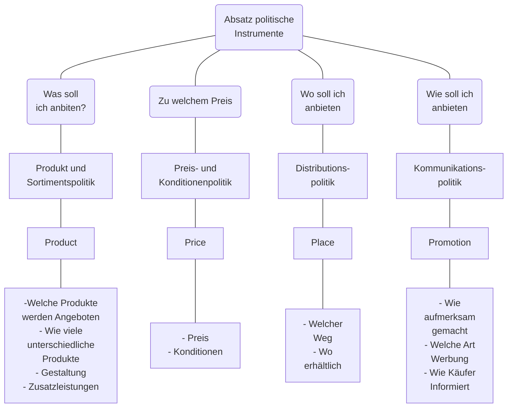

## Die 4 Ps des Marketings
1. **Product**
	Produkt und Sortimentspolitik
2. **Place**
	Preis und Konditionenpolitik
3. **Price**
	Absatzorganisation
4. **Promotion**
	Werbung & Verkaufsförderung

## Marktforschung

### Marktdiagnose
Erfassung der gegenwärtigen Marktsituation
#### Marktanalyse
Analyse des Marktes zu einem bestimmten Zeitpunkt
#### Marktbeobachtung
Beobachtung des Marktes im Zeitablauf

### Marktprognose
Abschätzung der zukünftigen Marktentwicklung

### Marktorientierte Fragen

### Methoden der Marktforschung

#### Befragung
Umfrage unter Käufern am:
- Testmarkt
- Experteninterviews
**Messziele**:
- Motive
- Einstellungen
- Image
#### Beobachtung
Registrierung von Verhaltensweisen
**Messziel**:
- Kundenverhalten
- Umsatzzeitpunkt
- Reaktion bei Veränderungen
#### Labortest
Verhaltensreaktionen mit Versuchspersonen unter Labor Bedingungen
**Messziel**:
- Verpackung
- Werbemittelwirkung
#### Markttest
Kaufverhalten im Testmarkt
**Messziel**:
- Wirkung aller Marketingmaßnahmen in Echt

### Praktische Marktforschung am Beispiel JYSK
#### Distributionspolitik

##### Auf welchem weg sollen die Produkte den Kunden erreichen?

 Wo erhältlich?
