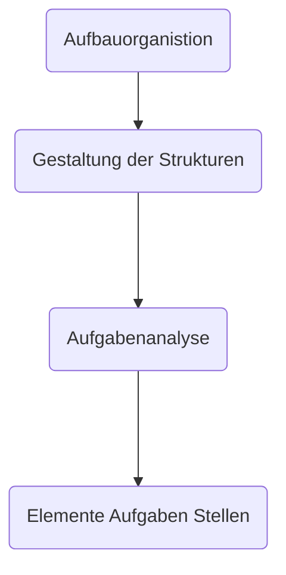
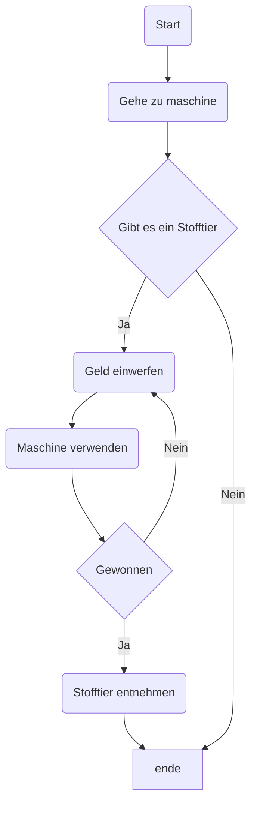

#Stelleninserat = Stellenangebot z.B. in der Zeitung 

#Stellenbeschreibung = Beschreibung einer Stelle für den Angestellten(Firmenintern)

#Ablauforganisation zeigt den Ablauf von Aufgaben:
- welche Abteilungen sind beteiligt
- welche Sachmittel
	- wie ist der Ablauf
- wo an welchem Ort

#Ablauforganisation Ziele:
- Optimierung der Kapazitätsauslastung
- Verringerung des Zeitaufwands
- Steigerung der Kapazität
- Verringerung der Fehlerquoten
- Reduzierung der Verteil und Transportaufwendungen durch Optimierung der Arbeitsordnung 
- Erhöhung der Termintreue
- humane Gestaltung der Arbeitsplätze

## Unternehmen & Organisation

## Was ist ein #Prozess?

* Gesamtheit aufeinander einwirkender Vorgänge
* #Arbeitsprozess
	* Alle Tätigkeiten die notwendig sind um ein Produkt herzustellen
* #Arbeitsablauf (Workflow)
	* wie Aufgaben ausgeführt werden.

> Die Prozesse eines Unternehmens müssen gemanaged werden

### Ablauforganisation
#Opimaler-Prozessablauf:
* Bestimmung von Input / Output
* Definition von Schnittstellen bzw. Wechselwirkungen
* Bestimmung der notwendigen Ressourcen
* Festlegung der prozessbezogenen Rollen und Verantwortlichkeiten
* Maßnahmen zum Umgang mit Risiken und Chancen
* Überwachung der Prozesse durch Leistungsindikatoren
* Änderungen der Abläufe bei Bedarf / fortlaufende Verbesserung
### Arbeitsanalyse
- Arbeitsinhalt: Was ist zu tun?
- Berarbeitungszeitpunkt: Wannn und wie lange wird gearbeitet?
- Arbeitsraum: Wo wird gearbeitet?
- Arbeitsmittel: Womit wird gearbeitet
- Die Personen: Wer soll arbeiten?
- Die Entscheidungsbefugnis: Wer darf was entscheiden

