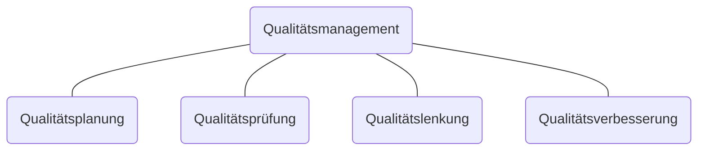

#Qualität ist die Gesamtheit von Eigenschaften und Merkmalen eines Produkts oder einer Dienstleistung, die sich auf deren Eignung zur Erfüllung festgelegter oder vorausgesetzter Erfordernisse bezieht.

#Qualitätsmerkmal e sind:
- messbar
- zählbar
- beurteilbare ...
Produkteigenschaften, welche die Qualität des Produkts beschreiben.
Um eine Bewertung der Qualität eines Produkts machen zu können, werden den Qualitätsmerkmalen entsprechende #Merkmalswert e zugeordnet.

|             | #Qualitätsmerkmal           | #Merkmalswert                        |
| ----------- | --------------------------- | ------------------------------------ |
| messbar     | Durchmesser Schichtdicke | 10, 20, 30 mm 5, 8, 10 $\micro$mm |
| zählbar     | Schweißpunkte               | 10,15,20 je m                        |
| beurteilbar | Design Geschmack         | attraktiv/neutral, gut               |

Neben den Produkteigenschaften gehören zu den #Qualitätsmerkmal en aber auch Merkmale im #Produktumfeld, wie z.B. Beratung, Verpackung, Kundendienst, Bedienungsanleitung usw.

#Basisanforderungen sind Produkteigenschaften, deren Erfüllung vom Kunden als selbstverständlich vorausgesetzt wird,

#Leistungsandforderung en werden vom Kunden konkret nachgefragt.

#Begeisterungsanforderungen werden vom Kunden nicht erwartet, aber mit Begeisterung wahrgenommen

![[Drawing 2024-09-04 12.17.20.excalidraw | 1000]]

## Fehler

Bei vielen Qualitätsmerkmalen ist es kaum bzw. gar nicht möglich, den Merkmalswert bei der Herstellung der Produkt genau zu erreichen.

Es wird daher meist ein #Bandbreite angegeben, wobei der Bereich zwischen oberem und unterem Grenzwert als #Toleranzbereich bezeichnet wird. Liegt der am Produkt gemessene Istwert des Qualitätsmerkmals außerhalb dieses Toleranzbereich, hat dieses Produkt einen Fehler und muss ausgeschieden werden.

## Qualität und Fehler
Abweichungen von den Merkmalen, die Qualität ausmachen, sind Fehler. Zuerst werden diese Merkmale definiert. Dann kann eine Bandbreite von zulässigen Abweichungen festgelegt werden, welche Prozesse, Leistungen oder Produkte so fehlerhaft sind, dass sie nicht mehr verwendbar (verkaufbar) sind.
Diese Bandbreite wird Toleranz genannt.

- #Nebenfehler entsprechen geringen Abweichungen von den festgesetzten Merkmalen, welche die Funktionalität nur unwesentlich mildern.
- #Hauptfehler sind nicht kritisch, können aber zu einem Ausfall führen
- #Kritische-Fehler können zu einer Gefahr für Personen werden.
### Qualitätskosten
- #Fehlerkosten entstehen dadurch, dass die hergestellten Produkte den festgelegten Qualitätsmerkmalen nicht entsprechen. Dies sind beispielsweise Kosten für Ausschuss, Nacharbeit, Garantieleistungen, Produkthaftung, Imageverlust usw.
- #Fehlerverhütungkosten für die vorbeugende Fehlervermeidung. Dazu gehören Qualitätsplanung, Lieferantenbeurteilung, Prüfplanung und Mitarbeiterschulung
- #Prüfkosten der laufenden Kontrolle der Qualität in der Fertigung. Sie umfassen Wareneingangsprüfung, Fertigungszwischenprüfung, Endprüfung, Laboruntersuchungen und Prüfmittel
#Qualitätskosten sind abhängig vom #Qualitätsniveau im Unternehmen.
#### Qualitätskosten vs. Fehlerfolgekosten

## Bereiche des Qualitätsmanagement

> #Qualitätsmanagement umfasst die Planung und Organisation aller Maßnahmen, die notwendig sind, um die gewünschte bzw. geforderte Qualität der Produkte sicherzustellen.

