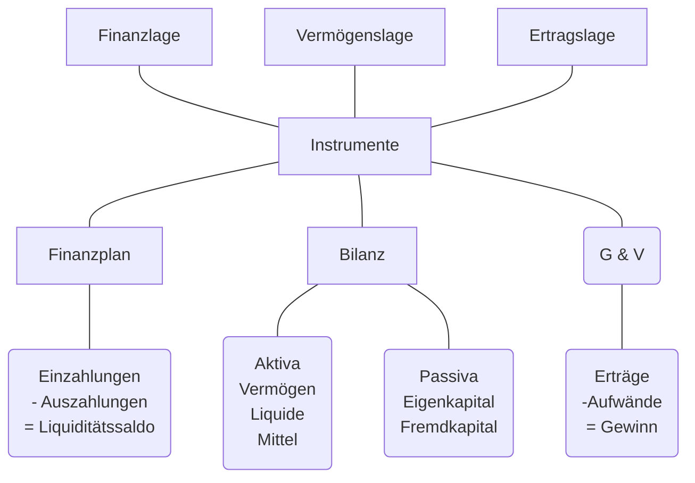

## Grundbegriffe

### Gewinn Ermitteln
#### Einnahmen - Ausgaben
| Erträge      | Einnahmen     |
| ------------ | ------------- |
| -Aufwände    | -Ausgaben     |
| ------------ | ------------- |
| = Gewinn     |               |
#### Vermögensvergleich

| Aktiv           | Bilanz                 | Passiv       |
| --------------- | ---------------------- | ------------ |
| Anlage Vermögen | \|\|\|\|\|\|\|\|\|\|\| | Eigenkapital |
| Umlage Vermögen | \|\|\|\|\|\|\|\|\|\|\| | Fremdkapital |
| $\Sigma$        | \|\|\|\|\|\|\|\|\|\|\| | $\Sigma$     |
| Investition     | \|\|\|\|\|\|\|\|\|\|\| | Finanzierung |

### Produktivität
Verhältnis von Output zu Input
### Wirtschaftlichkeit
Wirtschaftlich wenn Wertzuwachs (Erträge größer als der Aufwand)
### Gewinn
Überschuss der Erträge über die Aufwendungen
### Rentabilität
#### Gewinn in Relation zum Kapitaleinsatz:
$Kapitalrentabilität = Gewinn / Kapital * 100$
#### Gewinn in Relation zum Umsatz:
$Umsatzrentabilität = Gewinn / Umsatz * 100$

### Finanz-, Vermögens-, Ertragslage

## Aufgaben des betrieblichen Rechnungswesens

|               | Erläuterung zu den Aufgaben des Rechnungswesen                                                              |
| ------------- | ----------------------------------------------------------------------------------------------------------- |
| Dokumentation | Aufzeichnung der Geschäftsvorgänge. Sammeln und Aufgbereiten der Belege und Verbuchen der Geschäftsvorgänge |
| Information   | Bereitstellung von Information an Bund, Länder und Gemeinden, Investoren, Banken, Lieferanten usw.          |
| Disposition   | Aufbereitung des Zahlenmaterials, um unternehmerische Entscheidung zu treffen                               |
| Kontrolle     | Überwachung der Wirtschaftlichkeit der Liquidität                                                           |
