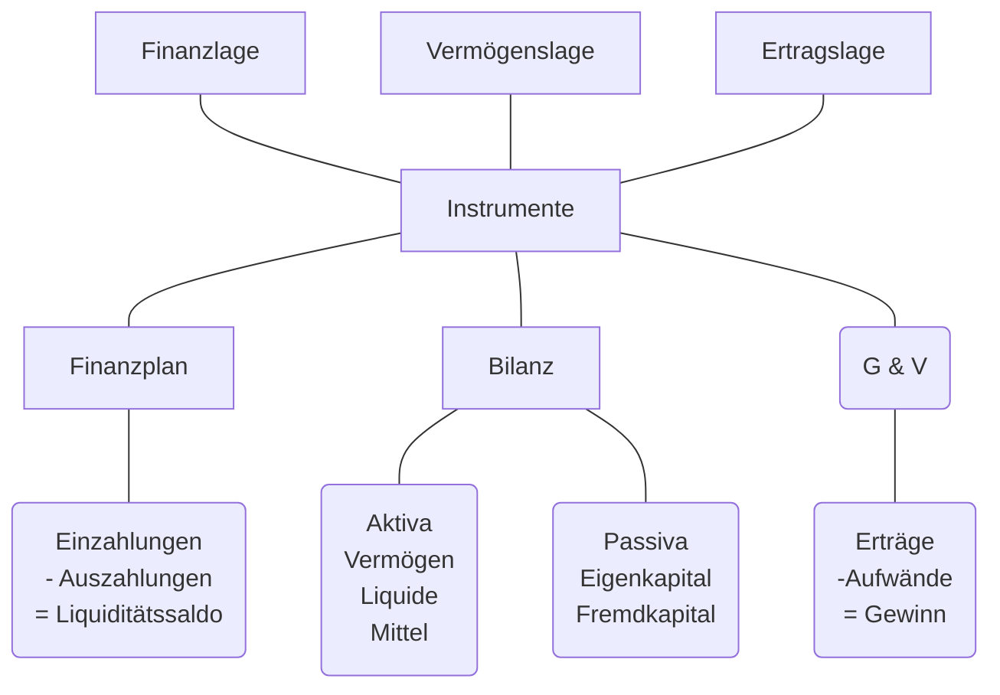

## Grundbegriffe

### Gewinn Ermitteln
#### Einnahmen - Ausgaben
| Erträge      | Einnahmen     |
| ------------ | ------------- |
| -Aufwände    | -Ausgaben     |
| = Gewinn     |               |
#### Vermögensvergleich

| Aktiv           | Bilanz                 | Passiv       |
| --------------- | ---------------------- | ------------ |
| Anlage Vermögen | \|\|\|\|\|\|\|\|\|\|\| | Eigenkapital |
| Umlage Vermögen | \|\|\|\|\|\|\|\|\|\|\| | Fremdkapital |
| $\Sigma$        | \|\|\|\|\|\|\|\|\|\|\| | $\Sigma$     |
| Investition     | \|\|\|\|\|\|\|\|\|\|\| | Finanzierung |

### Produktivität
Verhältnis von Output zu Input
### Wirtschaftlichkeit
Wirtschaftlich wenn Wertzuwachs (Erträge größer als der Aufwand)
### Gewinn
Überschuss der Erträge über die Aufwendungen
### Rentabilität
#### Gewinn in Relation zum Kapitaleinsatz:
$Kapitalrentabilität = Gewinn / Kapital * 100$
#### Gewinn in Relation zum Umsatz:
$Umsatzrentabilität = Gewinn / Umsatz * 100$

### Finanz-, Vermögens-, Ertragslage

## Aufgaben des betrieblichen Rechnungswesens

In erster Linie soll das Rechnungswesen die betrieblichen Vorgänge zahlenmäßig erfassen. Es sollen Erkenntnisse über den Zustand des Unternehmens und Unterlagen für zukünftige Entscheidungen gewonnen werden.

| Erläuterung zu | den Aufgaben des Rechnungswesen                                                                            |
| -------------- | ---------------------------------------------------------------------------------------------------------- |
| Dokumentation  | Aufzeichnung der Geschäftsvorgänge. Sammeln und Aufbereiten der Belege und Verbuchen der Geschäftsvorgänge |
| Information    | Bereitstellung von Information an Bund, Länder und Gemeinden, Investoren, Banken, Lieferanten usw.         |
| Disposition    | Aufbereitung des Zahlenmaterials, um unternehmerische Entscheidung zu treffen                              |
| Kontrolle      | Überwachung der Wirtschaftlichkeit der Liquidität                                                          |

## Teilgebiete des Rechnungswesen
Eine wesentliche Aufgabe der Unternehmensführung ist es, das Unternehmen zu steuern, organisatorische Rahmenbedingungen zu schaffen und somit die gesamte Organisation auf ein gemeinsames Ziel hinzulenken.

| Buchführung                           | Kostenrechnung                                  | Betriebliche Statistik                 | Planungsrechnung                           |
| ------------------------------------- | ----------------------------------------------- | -------------------------------------- | ------------------------------------------ |
| Unternehmensbezogen                   | Betriebsbezogen                                 | Vergleischrechnung                     | Vorschaurechnung                           |
| Periodenbezogene Zeitrechnung         | Stückrechnung und periodenbezogene Zeitrechnung | Aufbereitung und Auswertung der Zahlen | Erstellen von Prognosen und Budgets        |
| Quelle für die Ermittlung des Gewinns | Überwachung der Wirtschaftlichkeit              | Überwachung des Betriebsgeschehens     | Soll-Ist-Vergleich und Abweichungsanalysen |
| RW im                                 | engeren Sinn                                    | RW im                                  | weiteren Sinn                              |

### Finanzbuchhaltung
externes Rechnungswesen (Financial Accounting)
### Kostenrechnung
Kalkulation (internes Rechnungswesen (Management Accounting))
### Betriebliche Statistik
### Planungsrechnung

### Einführung in das betriebliche Rechnungswesen
Die Gewinnermittlung...
- Ist für die Unternehmer gesetzlich vorgeschrieben
- dient als Grundlage für die Besteuerung
- dient der Informationsbeschaffung für interne Kontroll- und Kalkulationszwecke
- erfüllt die Informationspflicht gegenüber Kreditinstituten, Gläubigern und Anteilseignern
#### Buchführungspflicht
Unternehmer sind verpflichtet Bücher zu führen und Geschäftsfälle ordnungsgemäß  ersichtlich machen. Die Bestimmungen sind in Gesetzen fesgehalten:
- im Unternehmensgesetzbuch (UGB)
- in der Bundesabgabenordnung (BAO)
- im Einkommenssteuergesetz (EStG)
- im Umsatzsteuergesetz (UStG)

#### Buchführungsgrenzen
#### Formvorschriften
Formvorschriften sind in der Bundesabgabenordnung enthalten und besagen, dass die zu führenden Bücher und Aufzeichnungen einem sachverständigen Dritten einen Überblick über die Geschäftsvorgänge vermitteln müssen. Die Aufzeichnungen können manuell oder maschinell durchgeführt werden. Dabei gelten folgende Vorschriften:

- Aufzeichnung sind in einer lebenden Sprache zu führen
- Aufzeichnungen müssen beglaubigt übersetzt werden
- Chronologisch geordnet
- Vollständig und richtig
- Aufzeichnungen zeitgerecht vorgenommen
- Aufzeichnungen erfolgen in Konten/Büchern. Bezeichnung -> Art der Geschäftsfälle schließen lassen.