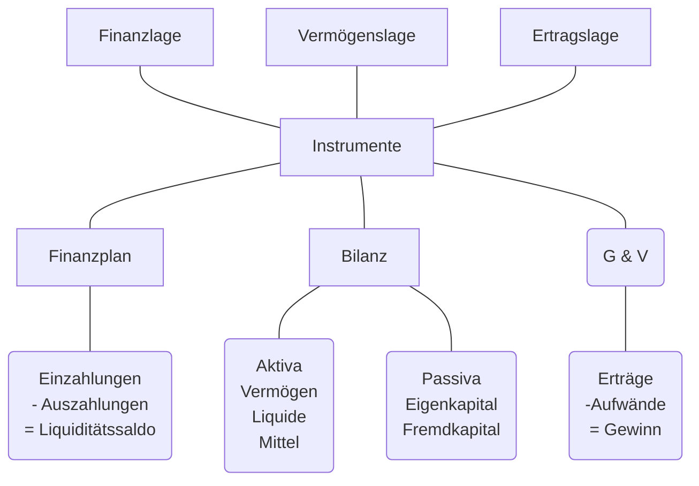

## Grundbegriffe

### Gewinn Ermitteln
#### Einnahmen - Ausgaben
| Erträge      | Einnahmen     |
| ------------ | ------------- |
| -Aufwände    | -Ausgaben     |
| = Gewinn     |               |
#### Vermögensvergleich

| Aktiv           | Bilanz                 | Passiv       |
| --------------- | ---------------------- | ------------ |
| Anlage Vermögen | \|\|\|\|\|\|\|\|\|\|\| | Eigenkapital |
| Umlage Vermögen | \|\|\|\|\|\|\|\|\|\|\| | Fremdkapital |
| $\Sigma$        | \|\|\|\|\|\|\|\|\|\|\| | $\Sigma$     |
| Investition     | \|\|\|\|\|\|\|\|\|\|\| | Finanzierung |

### Produktivität
Verhältnis von Output zu Input
### Wirtschaftlichkeit
Wirtschaftlich wenn Wertzuwachs (Erträge größer als der Aufwand)
### Gewinn
Überschuss der Erträge über die Aufwendungen
### Rentabilität
#### Gewinn in Relation zum Kapitaleinsatz:
$Kapitalrentabilität = Gewinn / Kapital * 100$
#### Gewinn in Relation zum Umsatz:
$Umsatzrentabilität = Gewinn / Umsatz * 100$

### Finanz-, Vermögens-, Ertragslage

## Aufgaben des betrieblichen Rechnungswesens

In erster Linie soll das Rechnungswesen die betrieblichen Vorgänge zahlenmäßig erfassen. Es sollen Erkenntnisse über den Zustand des Unternehmens und Unterlagen für zukünftige Entscheidungen gewonnen werden.

| Erläuterung zu | den Aufgaben des Rechnungswesen                                                                            |
| -------------- | ---------------------------------------------------------------------------------------------------------- |
| Dokumentation  | Aufzeichnung der Geschäftsvorgänge. Sammeln und Aufbereiten der Belege und Verbuchen der Geschäftsvorgänge |
| Information    | Bereitstellung von Information an Bund, Länder und Gemeinden, Investoren, Banken, Lieferanten usw.         |
| Disposition    | Aufbereitung des Zahlenmaterials, um unternehmerische Entscheidung zu treffen                              |
| Kontrolle      | Überwachung der Wirtschaftlichkeit der Liquidität                                                          |

## Teilgebiete des Rechnungswesen
Eine wesentliche Aufgabe der Unternehmensführung ist es, das Unternehmen zu steuern, organisatorische Rahmenbedingungen zu schaffen und somit die gesamte Organisation auf ein gemeinsames Ziel hinzulenken.

| Buchführung                           | Kostenrechnung                                  | Betriebliche Statistik                 | Planungsrechnung                           |
| ------------------------------------- | ----------------------------------------------- | -------------------------------------- | ------------------------------------------ |
| Unternehmensbezogen                   | Betriebsbezogen                                 | Vergleischrechnung                     | Vorschaurechnung                           |
| Periodenbezogene Zeitrechnung         | Stückrechnung und periodenbezogene Zeitrechnung | Aufbereitung und Auswertung der Zahlen | Erstellen von Prognosen und Budgets        |
| Quelle für die Ermittlung des Gewinns | Überwachung der Wirtschaftlichkeit              | Überwachung des Betriebsgeschehens     | Soll-Ist-Vergleich und Abweichungsanalysen |
| RW im                                 | engeren Sinn                                    | RW im                                  | weiteren Sinn                              |

### Finanzbuchhaltung
externes Rechnungswesen (Financial Accounting)
### Kostenrechnung
Kalkulation (internes Rechnungswesen (Management Accounting))
### Betriebliche Statistik
### Planungsrechnung

### Einführung in das betriebliche Rechnungswesen
Die Gewinnermittlung...
- Ist für die Unternehmer gesetzlich vorgeschrieben
- dient als Grundlage für die Besteuerung
- dient der Informationsbeschaffung für interne Kontroll- und Kalkulationszwecke
- erfüllt die Informationspflicht gegenüber Kreditinstituten, Gläubigern und Anteilseignern
#### Buchführungspflicht
Unternehmer sind verpflichtet Bücher zu führen und Geschäftsfälle ordnungsgemäß  ersichtlich machen. Die Bestimmungen sind in Gesetzen fesgehalten:
- im Unternehmensgesetzbuch (UGB)
- in der Bundesabgabenordnung (BAO)
- im Einkommenssteuergesetz (EStG)
- im Umsatzsteuergesetz (UStG)

#### Buchführungsgrenzen
#### Formvorschriften
Formvorschriften sind in der Bundesabgabenordnung enthalten und besagen, dass die zu führenden Bücher und Aufzeichnungen einem sachverständigen Dritten einen Überblick über die Geschäftsvorgänge vermitteln müssen. Die Aufzeichnungen können manuell oder maschinell durchgeführt werden. Dabei gelten folgende Vorschriften:

- Aufzeichnung sind in einer lebenden Sprache zu führen
- Aufzeichnungen müssen beglaubigt übersetzt werden
- Chronologisch geordnet
- Vollständig und richtig
- Aufzeichnungen zeitgerecht vorgenommen
- Aufzeichnungen erfolgen in Konten/Büchern. Bezeichnung -> Art der Geschäftsfälle schließen lassen.

13.02.2025

Formvorschriften
Die Formvorschriften sind in der Bundesabgabenordnung enhalten und besagen, dass die zu führenden Bücher und Aufzeichnungen einem sachverständigen Dritten einen Überblick über die Geschäftsvorgänge vermitteln müssen, Die Aufzeichnungen können manuell oder maschinell durchgeführt werden.
Die Aufzeichnungen in gebunden Form sollen mit fortlaufenden Zahlen versehen werden
Die Aufzeichnungen auf losen Blättern sollen in einem fortlaufen
Aufbewahrungspflicht
### Steuerliche Pauschalierung

Vorraussetzungen für die Basispauschalierung sind, dass
keine Buchführungspflicht besteht
auch nicht freiwillig eine doppelte Buchhaltung geführt wird
der Vorjahresumsatz des Betriebes nicht mehr als 220 000 Euro betragen hat
aus der Steuererklärung hervorgeht, dass die Pauschalierung in Anspruch genommen wird
Das Betriebsausgabenpauschale beträgt 12% des Nettoumsatzes aber maximal 26.400€

**Pauschalierung:**
- Abschreibungen
- Restbuchwerte abgegangener Anlagen
- Fremdmittelkosten
- Miete und Pacht
- Post und Telefon, Betriebsstoffe, Energie und Wasser
- Werbung
- rechts- und Beratungskosten
- Provisionen
- Büroausgaben
- Versicherungsprämien
- Betriebssteuern
- Instandhaltung
- Kraftfahrzeugkosten
- Reisekosten
- Trinkgelder
- Investitionsbedingter Gewinnfreibetrag
- Zusätzliche Betriebsausgaben
- Ausgaben für Löhne und Lohnebenkosten
- Ausgaben für Waren, Halberzeugnisse, Roh-und Hilfsstoffe sowie Zutaten
- Fremdlöhne
- Beitragszahlungen zur Sozialversicherung des Unternehmers
- abgeführte Umsatzsteuer
- Ab dem Jahr 2017 Reise-und Fahrtkosten
- Umsatzsteuer bei Bruttoverrechnung
- Beispiel einer steuerlichen Pauschalierung
- Umsatz
- Tatsächlicher Reise- und Fahrtkostenersatz
- Summe Betriebseinnahmen
- Wareneinkauf
- Personalaufwand
- Lohnnebenkosten
- Fremdlöhne
- Gewerbliche Sozialversicherungsbeiträge
- Tatsächlicher Reise- und Fahrtkostenersatz
- 12% Betriebsausgaben von 200 000€
- Summe Betriebsausgaben
- Gewinn
- Gewinnfreibetrag
- Zu versteuern
- Vorteilhaftigkeitvergleich

Um entscheiden zu können, ob die Basispauschalierung oder die Erfassung der tatsächlichen Kosten bzw der tatsächlich anfallenden Vorsteuer vorteilhafter ist, sollte eine Vergleichsrechnung im Sinne einer Gegenüberstellung der tatsächlichen Kosten im Vergleich zu Pauschalierung

## Einnahmen-Ausgaben-Rechnung
### EA-Rechnung

Die Einnahmen-Ausnahmen-Rechnung ist eine einfachere Form der Buchführung als die Bilanzierung (Doppelte Buchhaltung)
Um das Jahresergebnis zu ermitteln werden Einnahmen und Ausgaben gegenübergestellt
Es wird keine Bilanz erstellt
die Formschriften, Aufbewahrungsfristen und Regeln für Belege gelten wie in der Bilanzierung

#### Welche Aufzeichnungen sind erforderlich?
- Erfassung der Betriebseinnahmen und Betreibsausgaben
- Wareneingangsbuch
- Anlagenverzeichnis
- Lohnkonten, wenn Dienstnehmer beschäftigt werden
- Registrierkasse

Es ist möglich, die Führung der Bücher und Aufzeichnungen durch Datenträger vorzunehmen, es muss jedoch die inhaltsgleich, vollständige und geordnete Wiedergabe bis zum Ablauf der gesetzlichen Aufbewahrungsfrist jederzeit gewährleistet sein

**Achtung!** Excel-Tabellen sind keine Grundaufzeichnungen im Sinne der Bundesabgabenordnung (BAO), da sie jederzeit nachträglich veränderbar sind und nicht überprüft werden kann, ob Änderungen vorgenommen wurden oder nicht.

### Was sind Betriebseinnahmen?

Betriebseinnahmen liegen vor, wenn dem Steuerpflichtigen Geld oder geldwerte Vorteile im Rahmen des Betriebs zufließen.

**Dazu gehören insbesondere:**
- Einnahmen aus Lieferungen
- Einnahmen aus Leistungen
- Einnahmen aus Hilfsgeschäften
- Anzahlungen, Vorschüsse
- Sachentnahmen, die für private Zwecke erfolgen
	Diese führen zu keinem Geldzufluss, sind aber dennoch als Betriebseinnahmen zu erfassen

### Was sind Betriebsausgaben?
**Dazu gehören insbesondere:**
- Wareneinkauf
- Personalkosten
- Energiebezug
- Pflichtbeiträge zur Sozialversicherung der gewerblichen Wirtschaft
- Abschreibungen
- Geringe Wirtschaftsgüter
- Fahrt- und Reisespesen
- Honorare
- Miete, Pacht
- Kfz-Betriebskosten
- Reparaturen, Material, Versicherungen, Werbung, Bankzinsen
- Steuern und Abgaben
### Anlagenverzeichnis
#Anlagenverzeichnis dient dazu, sämtlich Vermögenswerte in Form von Anlagen im Unternehmen abzubilden.

Folgende Informationen sind im Anlagenverzeichnis ersichtlich:
- Laufende Inventarnummer
- Datum der Anschaffung oder Herstellung
- Art des Anlagengegenstands
- Name und Anschrift des Lieferanten
- Anschaffungswert bzw. Herstellungswert
- vorraussichtliche Nutzungsdauer
- Abschreibungssatz
- jährlicher Abschreibungsbetrag
- Restbuchwert am Ende der Rechnungsperiode

#### Beispiel
-  $AW = 100'$ 
-  $ND = 4$  
-  $AfA = \frac{AW}{ND} = \frac{100'}{4} = 25' / Jahr$

- Kauf: 25.6.
- Inbetriebnahme 25.6

#AfA : Abschreibung für Abnutzung

| Jahr | AW   | Inbetriebnahme | AfA            | BW (Buchwert) |                                                 |
| ---- | ---- | -------------- | -------------- | ------------- | ----------------------------------------------- |
| 1    | 100' | 25.6           | 25'            | 75'           |                                                 |
| 2    |      |                | 25'            | 50'           |                                                 |
| 3    |      |                | 25'            | 25'           |                                                 |
| 4    |      |                | 25' od. 2499,- | 0,- od. 1,-   | Errinerungseuro wenn Maschine im Betrieb bleibt |

$Netto = \frac{Brutto}{120} * 20$
$Grundwert = \frac{Grundwert+Prozentwert}{Prozentsatz + 1} * Prozentsatz$

## Gewinnermittlung
> Rechnungspflichtige Unternehmen müssen einen Jahresabschluss erstellen

Zur Gewinnermittlung durch uneingeschränkten Betriebsvermögensvergleich verptlichtet sind:
- steuerpflichtige
- mit Einkünften aus Gewerbebetrieb
- Die der Rechnungslegungsgpflicht nach dem UGB unterliegen

#UGB : Unternehmensgesetzbuch, Rechnungslegungspflicht nach §189 UGB

** Rechnungslegungspflichtige Unternehmen ("Bilanzierer")
- Sind verpflichtet am Ende jedes Geschäftsjahres einen Jahresabschluss zu erstellen

Im Jahresabschluss wird
- die finanzielle Lage (=Vermögenslage)
- der wirtschaftliche Erfolg (=Ertragslage) eines Unternehmens dem Erfolg aus dem vorangegangenen Geschäftsjahr gegenüberstellt
Der Jahresabschluss muss enthalten:
- eine Bilanz
- eine Gewinn- und Verlustrechnung

### Rechnungslegungsgpflichtige Unternehmen

Spätestens am Ende eines Geschäftsjahres möchten Gesellschafter bzw. Eigentümer eines Unternehmens wissen, ob sie erfolgreich gewirtschaftet haben

- Vermögenslage:
	- Wie reich / arm ist das Unternehmen zu einem bestimmten Zeitpunkt= Dies wird aus der Bilanz durch die Gegenüberstellung von Vermögen und Schulden ersichtlich. Die Differenz zwischen Vermögen und Schulden stellt das Eigenkapital (auch Reinvermögen genannt) dar
- Ertragslage:
	- Welchen Gewinn / Verlust hat das Unternehmen in einem bestimmten Zeitraum gemacht und wie ist dieser entstanden? Die Gewinn- und Verlustrechnung (G&V) zeigt, ob ein Gewinn oder ein Verlust im abgelaufenen Jahr erzielt wurde.