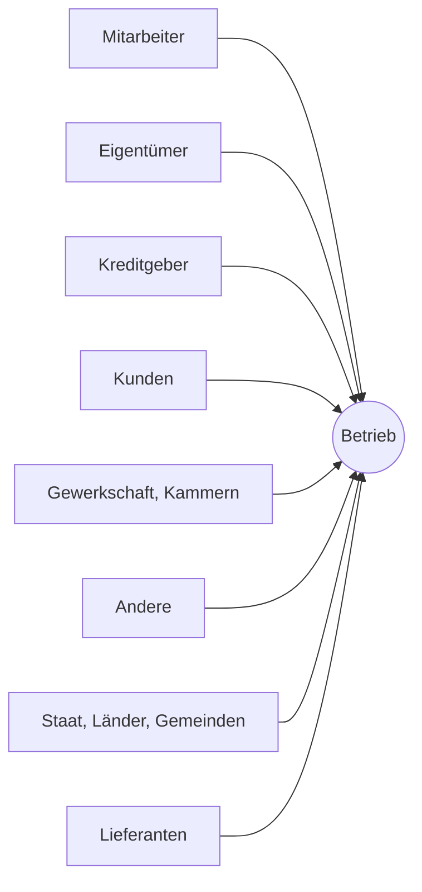
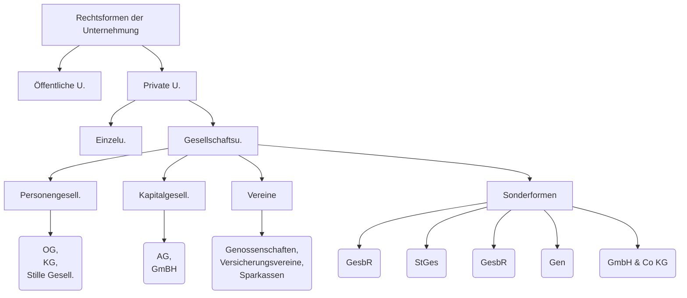
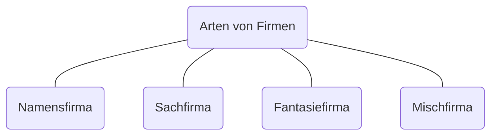

#Betriebe sind:
- ==Wirtschaftseinheiten==, in denen Sachgüter oder Dienstleistungen für den Bedarf dritter hergestellt werden.
- Der Schwerpunkt von betrieben liegt auf den technischen Einrichtungen der Organisation

#Unternehmen sind:
- Jede auf Dauer angelegte ==Organisation== selbständiger wirtschaftlicher Tätigkeit, der rechtlich-finanziellen Rahmen und Unternehmen umfassen einen oder mehrere Betriebe
- Unternehmen wird in verschiedenen Bedeutungen verwendet:
	- In der gleichen Bedeutung wie Betrieb
	- Nur für Betriebe, die sich in Privatbesitz befinden und die auf Gewinn ausgerichtet sind
	- In der gleichen Bedeutung wie Firma
#Firmen sind:
- Ist der ==Name==, unter dem ein Unternehmen auftritt und seine Rechtsgeschäfte tätigt
- Sind im Firmen Buch eingetragen

---

### Die Partner des Betriebes
- Kunden (sichere Lieferung)
- Lieferanten (sichere Abnahme)
- Mitarbeiter (sichere Arbeitsplätze)
- Eigentümer (Vermögenssicherung)
- Kreditgeber (Zinsen)
- Staat, Länder, Gemeinden (Steuern und Abgaben)
- Gewerkschaft, Kammern (Beiträge)
- "Andere" (Nachbarn: keine Belästigung durch Lärm, Abgase und Abfälle; …)
---
### Erwerbswirtschaftliche und Gemeinwirtschaftliche Betriebe
- #Erwerbswirtschaftliche Betriebe bieten Waren und Dienstleistungen am freien Markt an. Preise durch Angebot und Nachfrage. Zielsetzung z. B. möglichst hoher Gewinne
- #Gemeinwirtschaftliche Betriebe arbeiten ==nicht gewinnorientiert== und sind meist in Form von Vereinen organisiert. Mitglieder arbeiten meist ehrenamtlich. Zielsetzung ist die Verbesserung / Erfüllung von sozialen Aufgaben.
#### Betriebszweck
##### Betriebswirtschaftliche Betriebe:
- maximaler Gewinn
- maximaler Umsatz
- hohe Rentabilität
- geringe Kosten
- Erhöhen des Marktanteils
- Verbessern der Qualität
- Identifikation der Mitarbeiter
- Sichern der Arbeitsplätze
- Streben nach Ansehen und Macht
##### Gemeinwirtschaftliche Betriebe:
---
## Arten von Unternehmen
Klein Unternehmen --> <50 MitarbeiterInnen
Mittel Unternehmen --> < 250 Mitarbeiter
Groß Unternehmen --> > 250 Mitarbeiter

### Erfüllte Leistung:
Produktionsunternehmen --> produziert Ware (z.B. Tischlerei)
Dienstleistungsunternehmen --> bietet Dienstleistungen (z.B. Hotel)
	Handelsunternehmen --> verkauft Produkte (z.B. Supermärkte)
### Kunden
Konsumgüterunternehmen --> Dienstleistungen & Güter für Konsumenten
Investitionsgüterunternehmen --> Dienstleistungen & Güter für Unternehmen

----
## Klein und Mittel Betriebe ( #KMU)
> 99,7% aller Betriebe (in Österreich) sind #KMU s
> 67% aller Beschäftigten
> …
>Also sehr wichtig in der Österreichischen Wirtschaft

### Stärken
- Förderungen
- Flache Hierarchien
- Persönliche Bindung zwischen den MitarbeiterInnen und KundInnen
- Hoher Internationalisierungsgrad
- Innovationsgrad
- Nachhaltigkeit
### Schwächen
- Digitalisierung
- Risikokapitalfinanzierung
- Fachkräftemangel
- Energie- und Rohstoffpreise, Lieferkettenprobleme
---

## Definitionen Wiederholung
| Art | Erklärung | Beispiel |
| ---- | ---- | ---- |
| #Betrieb | Ort an dem das Unternehemen Waren herstellt, Dienstleistungen erbringt |  |
| #Unternehmen | Bezeichnet die gesamte Organisation die eine wirtschaftliche Tätigkeit ausführt |  |
| #Firma | Im Firmenbuch eingetragenen Namen und ein Zusatz (GmBH, AG, ...) der die Rechtsform angibt |  |

---
## Firmen
> Als Firma wird der Name bezeichnet unter dem ein Unternehmen seine Geschäfte abwickelt

| Art der Firma | Form | Beispiel |
| ---- | ---- | ---- |
| #Personenfirma | Name des Unternehmers*in | Peter Bauminger |
| #Sachfirma | aus dem Unterhnehmensgegenstand | Bier Union |
| #Fantasiefirma | werbewirksamer Name | Pizza-Flitzer |
| #gemischte-Firma | Kombination der Formen | Pizza Bauminger |

_Rechtsformen der Unternehmung_

| Rechtsformen | Erklärung |
| ---- | ---- |
| **e.U.** | eingetragener Unternehmer |
| **GmbH** | Gesellschaft mit beschränkter Haftung |
| **AG** | Aktiengesellschaft |
| **OG** | Offene Gesellschaft |
| **Inc.** | Incorporation (ein in den USA häufig gebrauchter Zusatz einer Firma) |

---
### #Firmenbuch
#Firmenbuch ist ein zentrales, öffentliches EDV-Verzeichnis, in dem wichtige Angaben über Unternehmen zu finden sind. Durch die **Öffentlichmachung** dieser Informationen werden Stakeholder, aber auch die Unternehmer selbst geschützt. Das #Firmenbuch trägt daher zu einer größeren Rechtsicherheit bei.
Jede Person hat die Möglichkeit einen #Firmenbuchauszug zu beantragen und so relevante Informationen über eingetragene Unternehmen einzuholen. Eine Datenabfrage ist gebührenpflichtig und bei jedem Firmenbuchgericht, Notar, Anwalt und Wirtschaftstreuhänder möglich.

Folgende Informationen sind im #Firmenbuch ersichtlich:
- Firmenbuchnummer
- Geschäftszweig nach eigenen Angaben
- #Firma 
- Rechtsform
- Name, Anschrift und Geburtsdatum der Gesellschafter
- Sitz und Geschäftsanschrift
- Zweigniederlassungen, laufende Insolvenzverfahren, bei größeren Unternehmen auch Geschäftsführer, #Prokuristen , Aufsichtsräte, etc.

#Prokuristen repräsentieren / vertreten die Firma mit einer Vollmacht

---
## Arten von Unternehmen
### #Einzelunternehmen
- Nur von einer Person
- Unternehmensgründer
	- sind meist auch Chefs ihrer Unternehmen. --> Unternehmen oft nach ihren Gründern benannt.
- Häufigste Rechtsform in Österreich
- Anmeldung
	- Muss beider Behörde angemeldet werden
 - #Firmenbuch
	 - müssen sich ins Firmenbuch eintragen, wenn sie zwei Jahre hintereinander einen Jahresumsatz von mehr als 700.000€ oder einmal mehr als 1 Mio. erwirtschaften
 - #Steuerung 
	 - Eigentümer
 - #Eigenkapital 
	 - kein Mindestkapital
 - #Haftung 
	 - Privatvermögen
 - #Gewinnverteilung 
	 - gesamte Gewinn dem Eigentümer
 - #Steuer 
	 - Einkommenssteuer
 - #Buchführung
	 - #Einnahmen-Ausgabenrechnung: >700.000€ -> Einkommenssteuer
	 - doppelte Buchhaltung: zwei Jahre >700.000€ oder einmalig über 1. Mio. €
---
### #Personengesellschaften
- Mindestens 2 Personen
- Vorteil (gegenüber #Einzelunternehmen )
	- Teilung von Aufgaben, Pflichten und Risiken
- Oft #Einzelunternehmen  --> #Personengesellschaften weil neuer Partner mehr Kapital
- Gründer von #Personengesellschaften sind auch Chefs.
- #Personengesellschaften  häufig Name der Gründer
---
### #Offene-Gesellschaften

* Gesellschafter haften solidarisch (jeder einzelne muss notfalls alleine alle Schulden annehmen)
* #Firmenbuch
	OG angehängt beim Firmennamen
* Gewerbeordnung
	Gewerbebetrieb als OG
* Gesellschaftsvertrag
	Mündlich oder schriftliche Vereinbarung der Rechte und Pflichten der Gesellschafter
* Gründungskosten
	 Sehr gering
* #Eigentümer
	Gesellschafter (min. 2)
* #Steuerung und #Kontrolle
	Gesellschafter sind berechtigt / verpflichtet mitzuarbeiten steuern und kontrollieren. Regelung --> Gesellschaftsvertrag
* Eigenkapital
	kein Mindestkapital
* #Haftung
	* persönlich (Privatvermögen)
	* unbeschränkt (Alle Ges. ohne Limit)
	* solidarisch (Jeder Ges. haftet für gesamte Schulden)
	* 5 Jahre nach Austritt noch Schulden Haftung seit dem Ausscheiden
* Gewinnverteilung
	 im Gesellschaftsvertrag festgelegt
* Steuern
	Einkommensteuer (vom Gewinn des jeweiligen Gesellschafters)
* #Buchführung
	* #Einnahmen-Ausgabenrechnung (Umsatz <700.000€)
	* doppelte Buchhaltung (Umsatz >700.000€ --> einmalige Buchhaltung, Umsatz >1.000.000€ --> doppelte Buchhaltung)
* Vorteile
	* einfach und kostengünstige Gründung
	* Risiko-, Aufgaben, Pflichten und Kapitalteilung
* Nachteile
	* Alle haften persönlich solidarisch unbeschränkt für das ganze Unternehmen
	* Konflikte bei Entscheidungen
### #Kommanditgeselschaften
* Ähnlich wie #Offene-Gesellschaften aber:
	* Komplementäre
		* Haften unbeschränkt solidarisch und privat
	* Kommanditisten
		* Haften nur mit ihrer Einlage
* #Haftung
	Wie bei der #Offene-Gesellschaften 
* #Buchführung 
	Wie bei der #Offene-Gesellschaften 
* Vorteile
	* einfache und kostengünstige Gründung
	* Kommanditistinnen können sich beteiligen ohne Risiko einer vollen Haftung
* Nachteile
	* Jeder Komplementär haftet unbeschränkt
	* mögliche Konflikte, wenn Kommanditisten sich nicht in die Unternehmensführung eingebunden fühlen
### #Kapitalgesellschaften
### #GmBH
![[Drawing 2024-02-16 11.10.54.excalidraw]]
* Stammkapital: min. 35.000€
* Haftung
	* GmbH: Haftet als juristische Person mit ihrem eigenen Vermögen für ihre Schulden
	* Gesellschafter: Nur mit der Stammeinlage
* #Gewinnverteilung 
	* Beschluss der Generalversammlung: beschließt ob der Gewinn an die Gesellschafter/innen ausgeschüttet wird oder zur Erhöhung des Eigenkapitals im Unternehmen bleibt
	* Gewinnausschüttung: Erfolgt gemäß dem jeweiligen Anteil am Stammkapital
* #Steuern 
	* #Körperschaftssteuer muss vom Gewinn 25% #Körperschaftssteuer zahlen. Mindest-Körperschaftssteuer beträgt 5% des Mindeststammkapitals
	* #Kapitalertragssteuer: die Gesellschafter/innen müssen von den ausgeschütteten Gewinnanteilen 27,5% #Kapitalertragssteuer 
* #Buchführung :
	* doppelte Buchhaltung
	* 
### #Aktiengesellschaft
Kapitalgesellschaften unterliegt strengen Vorschrift. Hohes Mindestkapital. Geschaftszahlen regelmäßig veröffentlichen. Nur für große Unternehmen. #Aktiengesellschaft kann ihre Aktien an einer Wertpapierbörse anmelden

>Banken müssen **verpflichtend** als #Aktiengesellschaft geführt werden

| Vorteile | Nachteile |
| ---- | ---- |
| Haftung der Aktionäre ist auf den Aktienanteil beschränkt | hohe Gründungskosten |
| Kapitalerhöhung ist durch die Ausgabe von neuen Aktien | hohes Mindestkapital |
| Es besteht die Möglichkeit, die Aktien an der Wertpapierbörse zu handeln. Dadurch können Aktien leicht ge- und verkauft werden | strenge Vorschriften für die Veröffentlichung von Bilanz- und GuV-Zahlen |
|  | hoher Aufwand und strenge Vorsrschriften für die Tätigkeit der Organe |
* #Gündung
	* Satzung: in form eines Notariatsakts (statt Gesellschaftsvertrag)
	* Firmenbuch: AG-Anhängsel
	* Gewerbeordnung: Gewerbeberechtigung beantragen
	* Gründungskosten: höher als bei anderen Rechtsformen
* #Eigentümer 
	* Eigentümer: Eine oder mehrere nät

## Stellvertretung
In Unternehmen fallen zahlreiche unterschiedliche Aufgaben an, welche die Unternehmensleitung oft nicht alle  selbst wahrnehmen kann.
Im **innerbetrieblichen*** Bereich genügen organisatorische Regelungen, bei den **Außenbeziehungen*** sind formale Regelungen notwendig, um diese Dritte gegenüber wirksam werden zu lassen.

|                              | Prokura                                                                  | Handlungsvollmacht                                        |
| ---------------------------- | ------------------------------------------------------------------------ | --------------------------------------------------------- |
| **Erteilung**                | Eigentümer, Vorstand                                                     | Auch Prokuristen                                          |
| **Eintragung im Firmenbuch** | ja                                                                       | nein                                                      |
| **Umfang**                   | alle Geschäfte                                                           | gewöhnliche Geschäfte                                     |
| **Ausnahmen**                | Grundstücke belasten oder verkaufen, Unternehmen auflösen oder verkaufen | Darlehen aufnehmen, Das Unternehmen vor Gericht vertreten |
| **Unterschrift-Zusatz**      | ppa \[per prokura]                                                       | i.V. \[in Vertretung]                                     |
