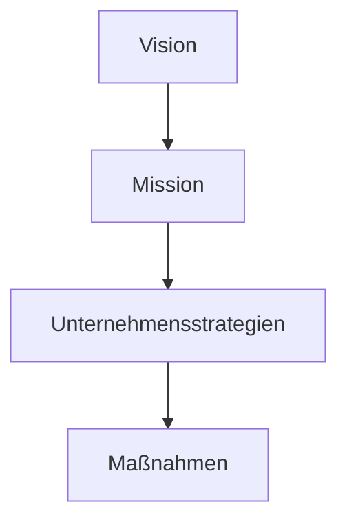
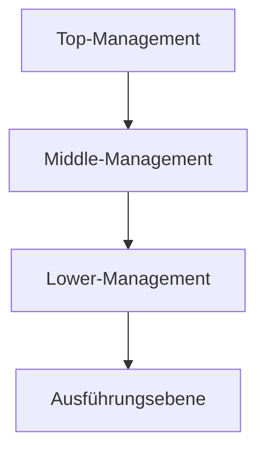

#Unternehmensfuehrung bezeichnet zum einen die Personen, die ein Unternehmen leiten. Zum anderen wird mit Unternehmensführung der Prozess des Führens bzw. Leitens eines Unternehmens benannt.

## Unternehmensführung im Überblick

### Management auf verschiedenen Unternehmensarchiestufen

## Normatives Management
### Vision
Eine Vision ist ein konkretes Vorstellungsbild der angestrebten Zukunft
#### Anforderungskritierien an Visionen
Erfolgreiche Visionen sollten idealerweise
- richtungsweisend (zukunftsorientiert)
- anspornend (begeisternd)
- realistisch und prägnant (kommunizierbar)
sein.

### Mission
Die Mission beschreibt den Auftrag (Unternehmenszweck) des eigenen Unternehmens.

Im Gegensatz zur Vision beschreibt die Mission nicht einen angestrebten Zustand in der Zukunft sondern definiert den Beitrag den Unternehmen zur Erschließung des in der Vision beschriebenen Nutzenpotenzials leisten will

### Unternehmensphilosophie
Die Unternehmensphilosophie umfasst die grundlegenden Einstellungen und Überzeugeungen einse Unternehmens.

#### Unternehmensetzhik als Teil der Unternehmensphilosophie
- Unternehmensethik beschreibt die moralischen Wertvorstellungen eines Unternehmens
- Teil der Unternehmensphilosophie
- unternehmensethische Überlegungen werden immer wichtiger

### Unternehmensziele
Unternehmensziele beschreiben einen in der Zukunft angestrebten Zustand, der durch bestimmte Handlungen erreicht werden soll.

#### Unternehmensziele, an denen sich Unternehmen orientieren sollen

Das oberste Unternehmensziel ist die Erhaltung der Existenz eines Unternehmens. Leider orientieren sich dabei viele Unternehmen allein am Ziel der Gewinnmaximierung. Dies führt jedoch zu Fehlentwicklungen in der Wirtschaft und der Gesellschaft, z.B. zu
- Umweltproblemen, da Umweltschutzmaßnahmen aus Kostengründen vernachlässigt werden.
- Arbeitslosigkeit, da Unternehmen ihre Produktion in Billiglohnländer verlagern

Monetäre und nicht monetäre Ziele für einen "Gewinn unter Nebenbedingungen"

| Monetäre Ziele                                | Nicht monetäre Ziele |
| --------------------------------------------- | -------------------- |
| Ziele die sich in Geldeinheiten messen lassen |                      |
|                                               |                      |
|                                               |                      |
|                                               |                      |

| Strategische Ziele                                    | Operative Ziele                                                                         |
| ----------------------------------------------------- | --------------------------------------------------------------------------------------- |
| Die Umsetzugn der Vision in langfristige Ziele        | Die Umsetzung der langfristigen strategischen Ziele in kurz- oder mittelfristige Ziele. |
| Verdoppelung des Umsatzes in den nächsten fünf Jahren | Das Absatzziel beträgt beim Produkt "Lux" 200 Einheiten für das vierte Quartal          |

### Unternehmensleitbild
Das Unternehmenslietbild ist die schriftliche Dokumentation der Vision, Mission, Werte, Normen und Unternehmensziele eines Unternehmens.