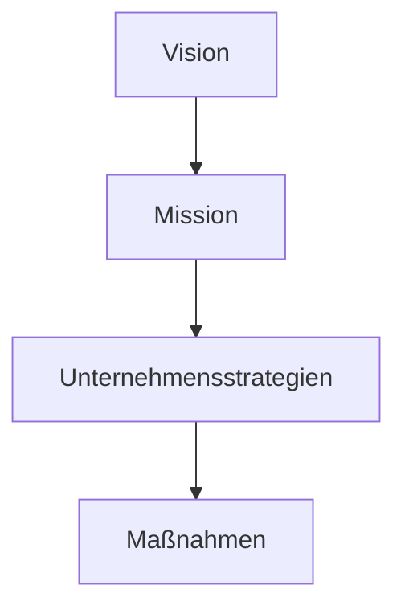
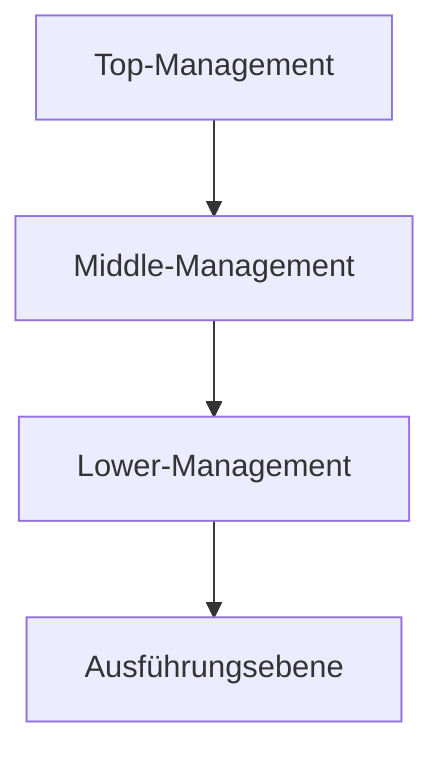

#Unternehmensfuehrung bezeichnet zum einen die Personen, die ein Unternehmen leiten. Zum anderen wird mit Unternehmensführung der Prozess des Führens bzw. Leitens eines Unternehmens benannt.

## Unternehmensführung im Überblick

### Management auf verschiedenen Unternehmensarchiestufen

## Normatives Management
### Vision
Eine Vision ist ein konkretes Vorstellungsbild der angestrebten Zukunft
#### Anforderungskritierien an Visionen
Erfolgreiche Visionen sollten idealerweise
- richtungsweisend (zukunftsorientiert)
- anspornend (begeisternd)
- realistisch und prägnant (kommunizierbar)
sein.