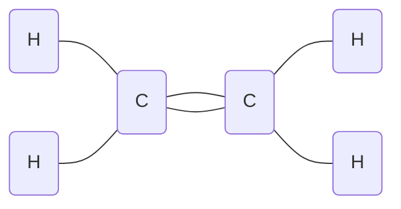

> Chemie der Kohlenstoffverbindungen

* Alkohole
* Ketone, Aldehyde
* Carbonsäuren, Ester

**Anwendung**:
	fossile Energieträger
	Farbstoffe
	Tenside
	Kunststoffe

Wöhler (1828):  Synthese von Harnstoff

#Bohrsche-Atommodell:
	![[Drawing 2024-09-10 10.21.19.excalidraw]]
#Elektronenkonfiguration 
![[Drawing 2024-09-10 10.22.09.excalidraw]]

1) #Dreifachbindung
Bsp.: $Ethin$  $C_2H_2$
$H - C ≡ C - H$
2) #Doppelbindung
Bsp.: $Ethen$  $C_2H_4$

