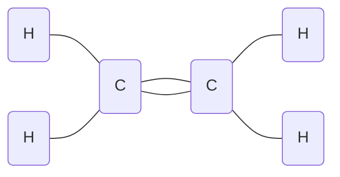
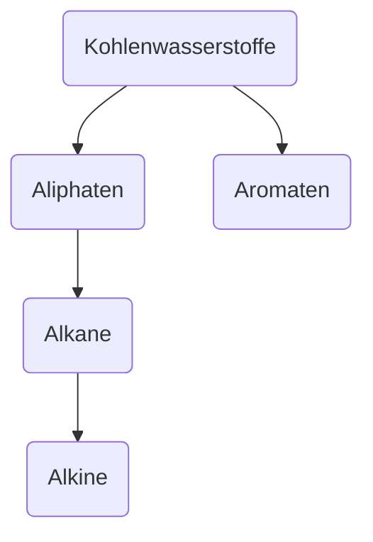

> Chemie der Kohlenstoffverbindungen

* Alkohole
* Ketone, Aldehyde
* Carbonsäuren, Ester

**Anwendung**:
	fossile Energieträger
	Farbstoffe
	Tenside
	Kunststoffe

Wöhler (1828):  Synthese von Harnstoff

#Bohrsche-Atommodell:
	![[Drawing 2024-09-10 10.21.19.excalidraw]]
#Elektronenkonfiguration 
![[Drawing 2024-09-10 10.22.09.excalidraw]]

1) #Dreifachbindung
Bsp.: $Ethin$  $C_2H_2$
$H - C ≡ C - H$
2) #Doppelbindung
Bsp.: $Ethen$  $C_2H_4$

## Kohlenwasserstoffe:

| #Aliphaten                                    | #Aromaten                                                                                                                |
| --------------------------------------------- | ------------------------------------------------------------------------------------------------------------------------ |
| #Alkane Einfachbindung (gesättigt)      | ![[Drawing 2024-09-17 11.24.00.excalidraw \| 100]] #delokalisierte$\pi$-Elektronen -> bilden eine #Elektronenwolke |
| #Alkene Doppelbindungen (ungesättigt)   |                                                                                                                          |
| #Alkine Dreifachbindung (ungesättigt^^) |                                                                                                                          |

## Strukturformel
Bsp.:
![[Drawing 2024-09-24 11.01.25.excalidraw]]
_Butan_
## Halbstrukturformel
$CH_3 - CH_2 - CH_2 - CH_3$

homologe Reihe der #Alkane 
1C: $CH_4$
2C: $C_2H_6$
3C:$C_3H_8$
4C:$C_4H_10$
5C:$C_5H_13$
6C:$C_6H_14$

## Aliphaten

**Alkane**: $CnH_{2n+2}$
**Alkene**: $C_n H_{2n}$
**Alkine**: $C_n H_{2n-2}$

#### Bsp.:
**Butan** : $CH_3 - CH_2 -CH_2 - CH_3$   $C_4H_{10}$
**Buten** : $CH_3 - CH = CH -CH_3$     $C_4H_8$
**Butin** : $CH_3 - C ≡ C - CH_3$            $C_4H_6$

### Eigenschaften der Alkane
$CH_3 - CH_2 - CH_2 - ...$

Polarität: $\Delta EN$ Symmetrie

1) Van-der-Waals-Kräfte (unpolare uw.)
2) Verbrennen zu $H_2O$ und $CO_2$
3) niedrige Schmelz- & - Siedepunkte
4) keine elektrische Leitfähigkeit

## IUPAC
1) Finde die Stammkette und benenne sie Stammkette = längste C-Kette
2) Suche die Seitenketten; zähle und benenne sie Stammname + "yl"
	z.B. Methan → Methylrest
3) Die Positionsangabe der Seitenketten soll zu möglichst kleinen Zahlen führen
4) Seitenketten werden alphabetisch angeordnet
5) Tritt eine Seitenkette mehrfach auf, wird Präfix vorangestellt
	z.B. die, tri, tetra,...
6) funktionelle Gruppen werden als Präfix oder Suffix angegeben, funktionelle Gruppen mit der höchsten Priorität als Suffix

Carbonsäure > Ester > Aldehyde > Ketone > Alkohole

### Stoffklassen
Bsp. Alkane
![[Drawing 2024-10-01 11.16.33.excalidraw]]
![[IMG_4939.jpg]]

## Beispiele
![[Drawing 2024-10-08 11.01.48.excalidraw]]