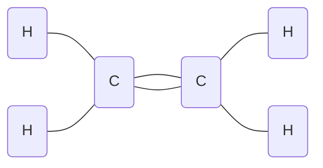
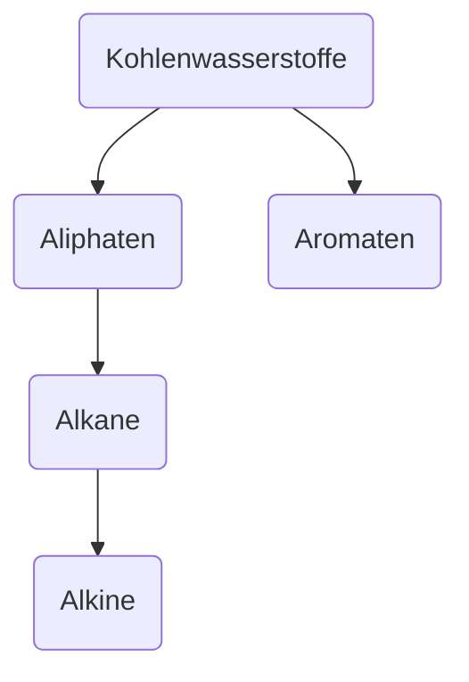

> Chemie der Kohlenstoffverbindungen

* Alkohole
* Ketone, Aldehyde
* Carbonsäuren, Ester

**Anwendung**:
	fossile Energieträger
	Farbstoffe
	Tenside
	Kunststoffe

Wöhler (1828):  Synthese von Harnstoff

#Bohrsche-Atommodell:
	![[Drawing 2024-09-10 10.21.19.excalidraw]]
#Elektronenkonfiguration 
![[Drawing 2024-09-10 10.22.09.excalidraw]]

1) #Dreifachbindung
Bsp.: $Ethin$  $C_2H_2$
$H - C ≡ C - H$
2) #Doppelbindung
Bsp.: $Ethen$  $C_2H_4$

## Kohlenwasserstoffe:

| #Aliphaten                                    | #Aromaten                                                                                                                |
| --------------------------------------------- | ------------------------------------------------------------------------------------------------------------------------ |
| #Alkane Einfachbindung (gesättigt)      | ![[Drawing 2024-09-17 11.24.00.excalidraw \| 100]] #delokalisierte$\pi$-Elektronen -> bilden eine #Elektronenwolke |
| #Alkene Doppelbindungen (ungesättigt)   |                                                                                                                          |
| #Alkine Dreifachbindung (ungesättigt^^) |                                                                                                                          |

## Strukturformel
Bsp.:
![[Drawing 2024-09-24 11.01.25.excalidraw]]
_Butan_
## Halbstrukturformel
$CH_3 - CH_2 - CH_2 - CH_3$

homologe Reihe der #Alkane 
1C: $CH_4$
2C: $C_2H_6$
3C:$C_3H_8$
4C:$C_4H_10$
5C:$C_5H_13$
6C:$C_6H_14$