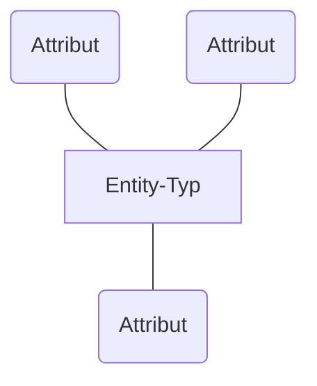
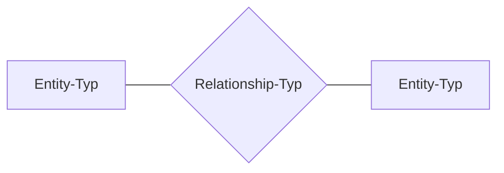
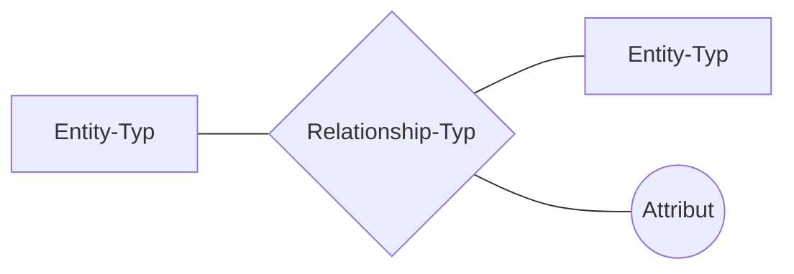
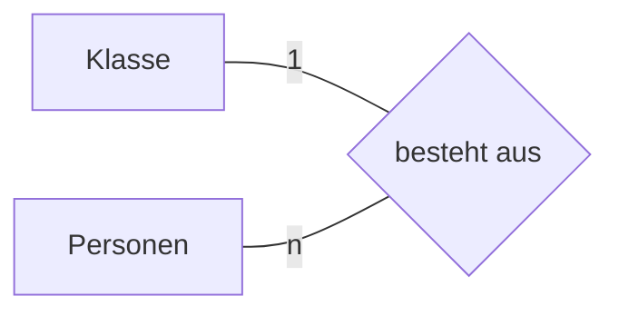
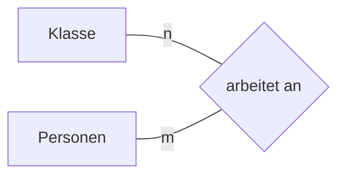

#ER-Modell
_Informationssysteme (INSY) - Datenbanken_

## Das Entity-Relationship-Modell
- grafische Hilfsmittel für den Datenbankentwurf
- Ausschnitte der realen Welt werden modelliert
- 1976 durch Dr. Peter Chen
- Grundbausteine:
	- #Entity 
	- #Relationship
- Entities und Relationships können Attribute haben

## Elemente des ER-Modells
- #Entitiy (Realisierung eines Entity-Typs)
	- #Entity-Typ (Person, Unterrichtsfach)
	- #Entity-Set
- #Attribut e(Eigenschaften)
	- #Domänen
- #Schlüssel und #Primärschlüssel (Einfaches und Kompaktes eindeutig zuordenbares Erkennungsmerkmal)
- #Relationship
	- #Beziehungsmenge
	- #Beziehungstyp
- #Kardinalität (Komplexität) (Wie ist eine Beziehung aufgebaut?)
	- #N-M Ein Element hat eine Beziehung zu mehreren Elementen

## Entity, Entity-Typ und Attribute

#Entity sind unterscheidbare Dinge/Lebewesen aus der realen Welt.
	Person Alice ist eine Entity ebenso die Person Bob

Sie unterscheiden sich durch ihre #Attribut e bzw. #Attributwert e
	Ein Attribut einer Person kann die Augenfarbe sein
	Werte für die Augenfraber wäre z.B. blau, grün, braun.

Zu einem #Entity-Typ gehören #Entity mit gleichen #Attribut e. Der konkrete Wert des Attributes ist irrelevant.
	Person ist der Entity Typ der Entities Alice und bobcat

### Entity Typ Notation
#### Chen notation

#### Alternative notation

| Entity Typ |
| ---------- |
| Attribut   |
| Attribut   |
| Attribut   |

## #Entity-Set und #Domänen

Ein #Entity-Set ist die Menge aller Entities, eines bestimmten #Entity-Typ s

Manche Attribute können nur bestimmte Werte oder Werte eines bestimmten Datentyps annehmen. 
	Ein Attribut Monat könnte als Werte nur die Monatsnamen von Jänner bis Dezember annehmen. 
	Beim Attribut Größe eines Entity-Typs Person könnte man die möglichen Werte auf Zahlen beschränken

## #Schlüssel und #Primärschlüssel 

Ein Schlüssel dient dazu eine #Entity in einem #Entity-Set eindeutig zu identifizieren.

Kann sich aus mehreren Attributen zusammensetzen.

Die Kombination der Attribute muss im #Entity-Set eindeutig sein.

Kein _natürlicher_ Schlüssel -> künstliches Attribut wird hinzugefügt
	Beispiel: Fortlaufende Nummer

Ein #Entity-Typ kann mehrere Schlüssel besitzen aber **nur einen Primärschlüssel** 
	Auch: Primary Key, PK

### Darstellung
> Darstellung des ER-Modells: Attribute des Primärschlüssels werden unterstrichen dargestellt

## Relationship und Relationship-Typ

### Darstellung

## Kardinalität

### Möglichkeiten von #Kardinalität

| Kürzel | Bezeichnung            | Erläuterung                                                                                                                                   |
| ------ | ---------------------- | --------------------------------------------------------------------------------------------------------------------------------------------- |
| 1:1    | Eins-zu-eins-Beziehung | Jede Entity eines Entity-Sets kann genau einer Entity eines anderen Entity-Sets zugeordnet                                                    |
| 1:n    | Eins-zu-n-Beziehung    | Jede Entity-Set kann einer oder mehreren Entities zugeordnet sein                                                                             |
| n:m    | n-zu-m-Beziehung       | Eine Entity oder mehrere Entities eines Entity-Sets kann/können einem Entity oder mehreren Entities eines anderen Entity-Sets zugeordnet sein |
## Beispiel für Beziehungen
![[Drawing 2024-09-11 13.49.51.excalidraw]]