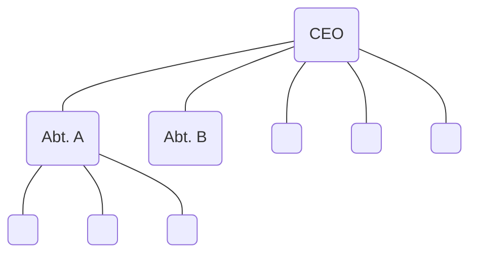

## Exkurs: Linienorganisation

### Abteilungen
- Vertrieb
- Support
- HR
- Marketing
- Produktion
- Kundenservice
- …

### Eigenschaften von #Linienorganisation
- jede Stelle ist einer Instanz untergeordnet
- viel Wert auf Disziplin
- Spezalistin in Abteliungen

\> für neu gegründete KMUs
\> für stabile, bürokratische Org.

**Vorteil**:
- hohe Problemlösungskapazität
- direkte Weisungs- & Infowege
- Spezialisierung
**Nachteile**:
- geringes Aufgabenspektrum -> Motivation
- ganzheitliches Denken
- starr, unflexibel
- MA lernen wenig dazu

## #Einflussorganisation 
- keine eigenen Projektorganisation
- PL versucht über Einfluss auf Schlüsselpersonen etwas zu erreichen • PL hat keine Weisungsbefugnisse 
- PL führt beratende und informierende Tätigkeiten aus → kleine/mittlere Projekte, teamorientierte Führungsstrukturen

**Vorteile**: flexibler Personaleinsatz keine Reorganisation für Projekte
**Nachteile**: niemand fühlt sich verantwortlich 

## #Reine-Projektorganisation

- Unternehmen macht nur Projekte
- A sind temporär dem PL unterstellt (fachlich und personell)
- PL hat Verantwortung für alle Ressourcen 
- Projekt ist selbständige Einheit, meistens in einem Raum → Projekte mit hohem Risiko und langer Dauer, MA Fulltime an dem Projekt arbeiten 

**Vorteile**: Identifikation mit dem Projekt Erfolge/Misserfolge gut zuordenbar klare Kompetenzen des PL
**Nachteile**: Beschäftigung der MA nach Projektabschluss unklar → Mit Freelancern Spitzen abfedern