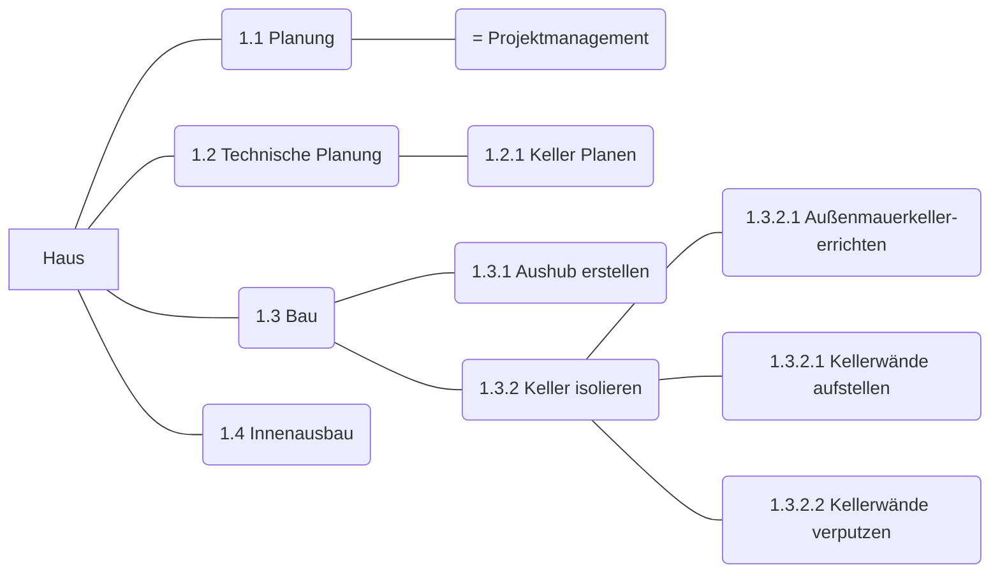

- Tätigkeiten (Arbeitspakete) -> immer mit Verb
- Phasen(zeitlich), chronologische Reihenfolge
- Nummerierung (PSP-Code)
- jede Phase endet mit Meilenstein
	~7 Meilensteine /Projekt

![[https://www.mermaidchart.com/raw/4ae55956-3db7-476d-bd14-c2a079bcea9e?theme=light&version=v0.1&format=svg]]

## Meilensteine
Pr