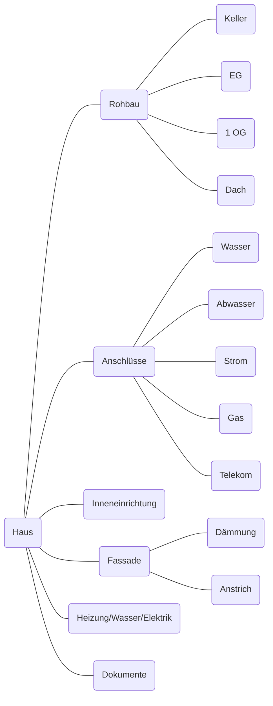
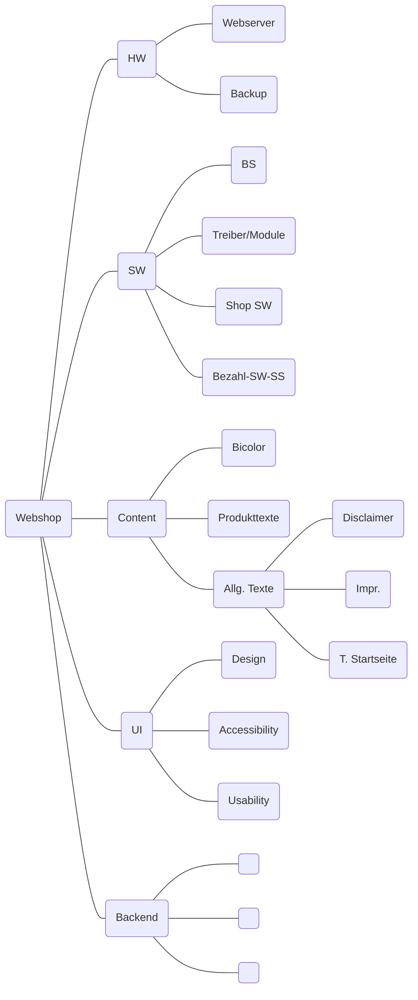

Objektstrukturplan OSP / Betrachtungsobjektplan BOP

Ziele -> OSP / BOP
Baumform, hierarchisch gegliederte Darstellung der Ergebnisse

```mermaid

graph LR
a(Haus) --- b(Rohbau)
a --- c(Anschlüsse)
a --- d(Inneneinrichtung)
a --- e(Fassade)
a --- f(Heizung/Wasser/Elektrik)
a --- g(Dokumente)

b --- h(Keller)
b --- i(EG)
b --- j(1 OG)
b --- k(Dach)

c --- l(Wasser)
c --- m(Abwasser)
c --- n(Strom)
c --- o(Gas)
c --- p(Telekom)

e --- q(Dämmung)
e --- r(Anstrich)
```

```mermaid
graph LR
a(Webshop) --- b(UI)
a --- c(HW)
a --- d(Backend)
a --- e(SW)
a --- f(Content)
c --- g(Webserver)
c --- h(Backup)
e --- i(BS)
e --- j(Treiber/Module)
e --- k(Shop SW)
e --- x(Bezahl-SW-SS)
f --- l(Bicolor)
f --- m(Produkttexte)
f --- n(Allg. Texte)
n --- o(Disclaimer)
n --- p(Impr.)
n --- q(T. Startseite)
b --- r(Design)
b --- s(Accessibility)
b --- t(Usability)
d --- u( )
d --- v( )
d --- w( )
```

