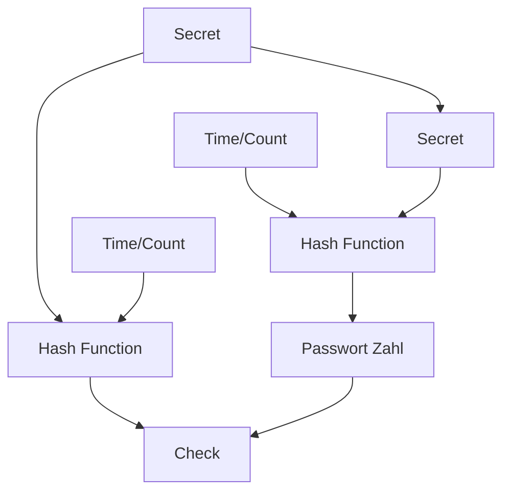

Passwortverschlüsselung und Message Authenticatin Codes (MAC)

## Hash-Funktionen
Anforderungen für kryptografische #Hash-Funktionen: Hashwert = **Digest** = "Fingerprint"
	Konstante Länge (obwohl Länge der Eingabe beliebig)
	Einwegfunktion (--> "Einbahn": kann nicht zurückgerechnet werden)
	Es muss schwierig sein, zwei Klartexte mit dem gleichen Hash-Wert zu finden
		kollisionsfrei (Keine 2 unterschiedliche Eingabedaten führen zum selben Hashwert)
		avalanche Effekt: kleine Änderung -> völlig anderes Ergebnis
	 langsam zu knacken -> keine Bruteforce-Attacke


## Funktionsprinzip #MAC
* Absender und Empfänger hängen an die Nachricht ein Geheimnis
* Sender rechnet aus Nachricht+Geheimnis den Hash-Wert (MAC) und überträgt Nachricht+MAC
* Empfangen und selbst berechnet sind gleich -> Garantie das der Absender authentisch ist und die Nachricht nicht manipuliert oder gestört wurde

## Zwei Faktor Authentisierung = 2FA

Time-based one-time password


## Empfehlungen zu Hash-Funktionen

#MD5: kann sehr schnell Kollisionen finden
#SHA-1(Secure Hash Algorithm): Nicht mehr verwenden (mangelhafte Kollisionsresistenz)

#SHA-2 gilt derzeit als sicher. Unterstütz mehrere längen des Hashwertes.
#SHA-3 Recht hoher Ressourcenbedarf, gilt als sehr sichere Hash-Funktion. Unterstützt ebenfalls mehrere Längen des Hashwertes

## Berechnung von Hash-Verten in der Kommandozeile

```bash
#Windows-Powershell
Get-FileHash *.zip -Algorithm SHA512
#Linux
sha256sum dateiname.zip
sha512sum dateiname.zip
md5sum dateiname.zip
```