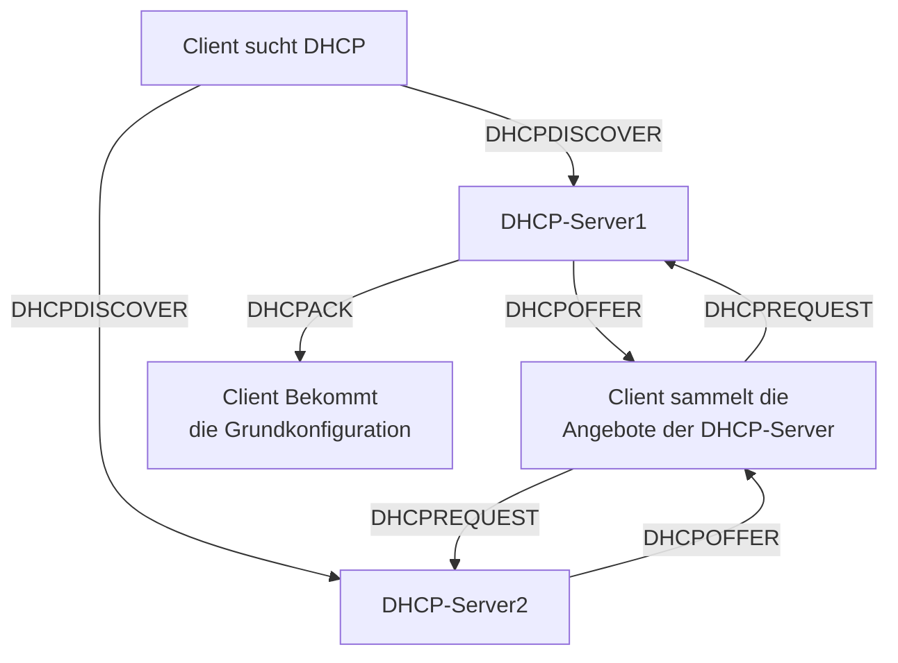

#DHCP … Dynamic Host Configuration Protocoll
- vergibt einem Client ohne TCP/IP - Konfiguration alle nötigen Infos
	- IP-Adresse + Subnetmask
	- Gateway
	- DNS-Server
	- Erweitert:
		- Timeserver
		- …

