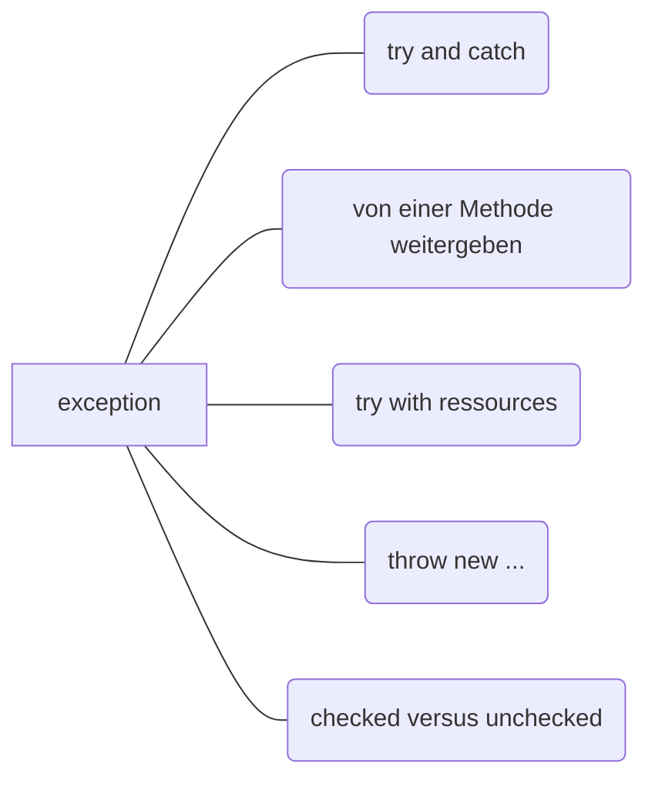
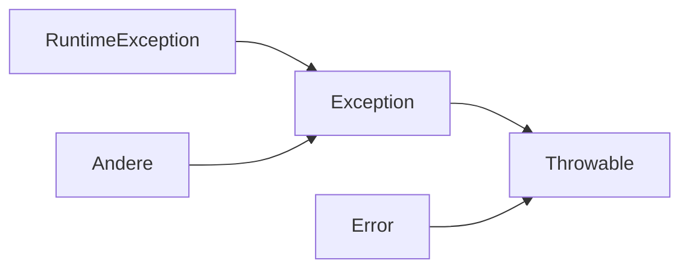

```java
//try and catch
try{
//regulärer Code
} catch(Fehlercode1 | Fehlercode 2){
//probiert wenn Fehlercode
} catch(Fehlercode 3){
//probiert wenn anderer Fehlercode
} finally{
//wird auf jeden fall immer ausgeführt, aufräum ausgeführt
}


throw new ... //Exception
```


_Mindmap zu `Exceptions`_
### try with ressources
`try ([Ressourcen anbringen]){} `

## Exception-Klassen

#Throwable Superklasse aller Fehlerklassen
#Error Superklasse aller Exceptions die mit verbindung der Java-Virtual-Machine auftreten
#Exzeption `Exceptions`, die durch Ihr Programm behandelt werden können, werden von der Klasse `Exception` abgeleitet
#RuntimeException Treten aufgrund eines Programmierfehlers ein.
#Andere Diese Ausnahmen treten durch nicht kontrollierbare Situationen ein (z. B. das Öffnen einer Datei, die nicht existiert)