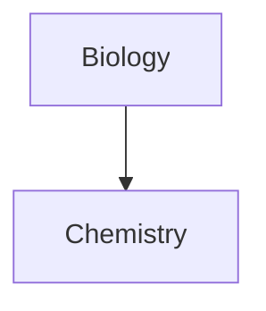

~~Strike~~
==Highlight==
[Wikipedia](https://wikipedia.com)


>Digga was das
> \-Manuel Klapper, 2024

- 1
- 2
- 3

- [x] complete
- [ ] not complete

1. hihi
	1. hihi
2. hehe
	- hehe
***
___
```js
function fancyAlert(arg) {
	if(arg) { 
		$.facebox({div:'#foo'})
	}
}
```
````java
public static void main(String[] args)
````
Footnote[^1].
[^1]: Fußnote


%%inlinevComment nicht sichtbar im lesemodus%%


| erst | zweite |
| ---- | ---- |
| hihi | hihi |
|  |  |
|  |  |




$$
\frac{a}{b} = 20 \
\alpha \Gamma \gamma \
x^2 \
\sqrt {a+b} \
\vert x \vert \
\lt \gt \le \ge \neq \
\approx \
\text{hihi}

$$

[[Misc/flowcharts]]
