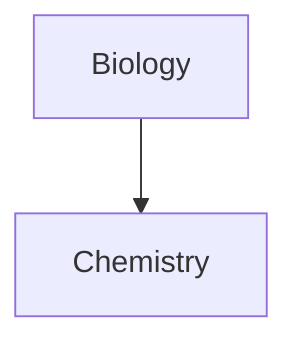
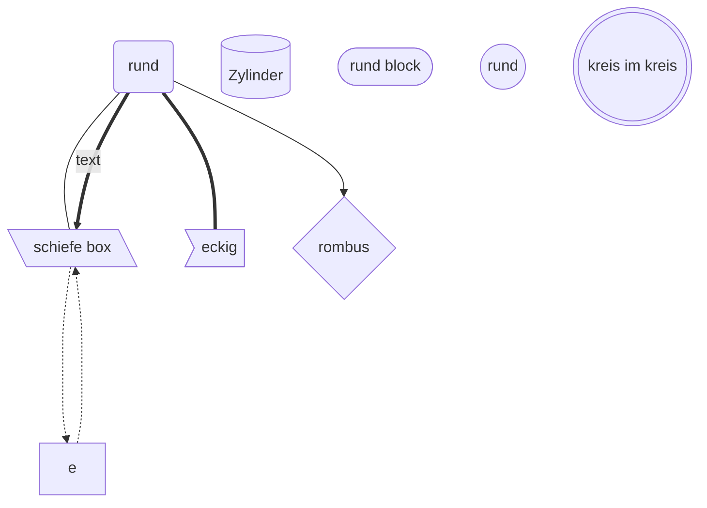

```mermaid
graph TD
A[Biology]
B[Chemistry]
A --> B
```

```mermaid
flowchart TD
a(rund) --- b
a === c>eckig]
a --> d{rombus}
a ==>|text| b
b[\schiefe box\] -..-> e
e -...-> b
f[(Zylinder)]
g([rund block])
h((rund))
i(((kreis im kreis)))
```
